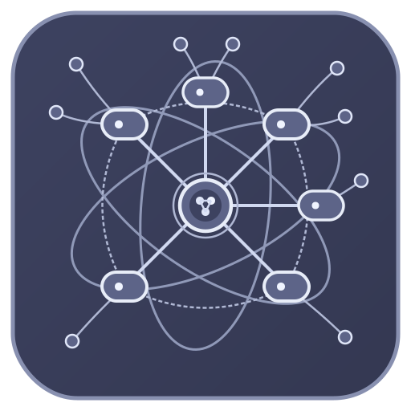
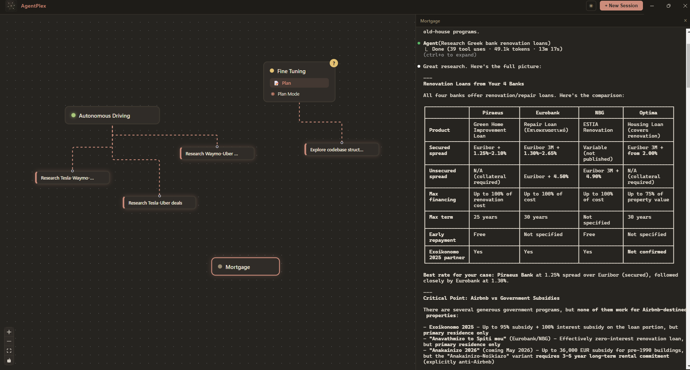

<p align="center">
  
</p>

<h1 align="center">AgentPlex</h1>

<p align="center">
  Multi-session Claude/Codex/GitHub CLI orchestrator with graph visualization.
</p>

<p align="center">
  <a href="https://github.com/AlexPeppas/agentplex/releases/latest"><strong>Download for Windows</strong></a> &nbsp;|&nbsp;
  <a href="#build-from-source">Build from source</a>
</p>

---

## Requirements

- [Claude CLI](https://docs.anthropic.com/en/docs/claude-cli) installed and authenticated

## Quick Start

Download **AgentPlex.exe** from the [latest release](https://github.com/AlexPeppas/agentplex/releases/latest) and run it. That's it.

> **macOS / Linux**: Pre-built binaries coming soon. For now, [build from source](#build-from-source).

## Installation

<a id="build-from-source"></a>

If you prefer to build from source instead of using the installer:

```bash
git clone https://github.com/AlexPeppas/agentplex.git
cd agentplex
pnpm install
pnpm start
```

To build a distributable installer:

```bash
pnpm make
```

### Global CLI shortcut (optional)

```bash
pnpm link --global   # one-time setup
agentplex            # launch from anywhere
```

To remove: `pnpm unlink --global agentplex`

## Dev Requirements

Building from source requires [Node.js](https://nodejs.org/) 20+ and native build tools for `node-pty`:

- **Windows**: [Visual Studio Build Tools](https://visualstudio.microsoft.com/visual-cpp-build-tools/) with "Desktop development with C++"
- **macOS**: `xcode-select --install`
- **Linux**: `sudo apt install build-essential python3`

pnpm is pinned via `packageManager` in package.json. If you have [corepack](https://nodejs.org/api/corepack.html) enabled (`corepack enable`), it will auto-install the correct version. Otherwise install pnpm directly: `npm install -g pnpm`.

## Features

- **Multi-session management** — run multiple Claude/Codex/GH CLI sessions side by side
- **Graph canvas** — drag, arrange, and connect session nodes on a visual canvas
- **HITL notifications** — get notified when a CLI session requires human input
- **Cross-session messaging** — send messages between sessions with optional Haiku-powered summarization
- **Sub-agent tracking** — visualize spawned sub-agents via JSONL transcript tailing
- **Plan & task visualization** — see plans and task lists rendered in the graph
- **Session resume** — resume previous Claude sessions with `claude --resume`
- **Dark / light mode** — warm terracotta palette with theme toggle
- **Inline rename** — double-click any node to rename it

<p align="center">
  
</p>

> Three concurrent sessions on the graph canvas: **Autonomous Driving** spawned 3 sub-agents comparing Tesla, Waymo, and Cruise. **Fine Tuning** is in plan mode working through a structured research plan — it's currently waiting for human input (indicated by the **?** badge). **Mortgage** crawls and looks for the best interest rates. Each node reflects real-time session status at a glance. Hover any session and click the send icon to share context with another session.

## Configuration

### Cross-session summarization (optional)

To enable AI-powered context summarization when sending messages between sessions, set your Anthropic API key using `AGENTPLEX_API_KEY` (not `ANTHROPIC_API_KEY`, which would conflict with Claude CLI's auth).

**Set it persistently (recommended):**

```bash
export AGENTPLEX_API_KEY=sk-ant-...       # macOS/Linux (~/.bashrc or ~/.zshrc)
set AGENTPLEX_API_KEY=sk-ant-...          # Windows (cmd)
$env:AGENTPLEX_API_KEY="sk-ant-..."       # Windows (PowerShell)
```

**Or inline when launching from source:**

```bash
AGENTPLEX_API_KEY=sk-ant-... pnpm start                          # macOS/Linux
$env:AGENTPLEX_API_KEY="sk-ant-..."; pnpm start                  # Windows (PowerShell)
```

Without this, cross-session messaging still works — it sends raw context instead of a summary.

## Usage

1. **Create sessions** — click "+ New Session" and pick a working directory
2. **Arrange nodes** — drag session nodes freely on the canvas
3. **Rename** — double-click a node label to rename it
4. **Send messages** — hover a node, click the send icon to share context with another session
5. **Resume** — use "Claude Resume" from the menu to continue a previous session

## Project Structure

```
agentplex/
├── src/
│   ├── main/                # Electron main process
│   │   ├── main.ts          # App entry point & window management
│   │   ├── session-manager.ts   # PTY session lifecycle
│   │   ├── ipc-handlers.ts      # IPC bridge between main & renderer
│   │   ├── jsonl-session-watcher.ts # JSONL transcript tailing for sub-agent detection
│   │   └── plan-task-detector.ts # Plan & task list parsing
│   ├── preload/
│   │   └── preload.ts       # Context bridge for renderer
│   ├── renderer/
│   │   ├── App.tsx           # Root React component
│   │   ├── store.ts          # Zustand state management
│   │   ├── components/       # UI components
│   │   │   ├── GraphCanvas.tsx   # React Flow canvas
│   │   │   ├── SessionNode.tsx   # Session graph node
│   │   │   ├── SubAgentNode.tsx  # Sub-agent graph node
│   │   │   ├── GroupNode.tsx     # Group container node
│   │   │   ├── SendDialog.tsx    # Cross-session messaging
│   │   │   ├── TerminalPanel.tsx # xterm.js terminal
│   │   │   ├── Toolbar.tsx       # Top toolbar
│   │   │   └── StatusIndicator.tsx
│   │   └── hooks/
│   │       └── useTerminal.ts    # Terminal lifecycle hook
│   └── shared/               # Shared utilities
│       ├── ansi-strip.ts
│       └── ipc-channels.ts
├── styles/
│   └── index.css             # Global styles
├── bin/
│   └── agentplex.mjs         # CLI entry point
└── package.json
```

## Tech Stack

| Layer | Technology |
|-------|-----------|
| Desktop shell | [Electron](https://www.electronjs.org/) |
| UI framework | [React](https://react.dev/) |
| Graph canvas | [React Flow](https://reactflow.dev/) |
| Terminal | [xterm.js](https://xtermjs.org/) |
| State | [Zustand](https://zustand-demo.pmnd.rs/) |
| PTY backend | [node-pty](https://github.com/microsoft/node-pty) |
| Summarization | [Anthropic SDK](https://docs.anthropic.com/en/docs/sdks) (optional) |

## Contributing

See [CONTRIBUTING.md](CONTRIBUTING.md) for guidelines.

## License

[MIT](LICENSE)
