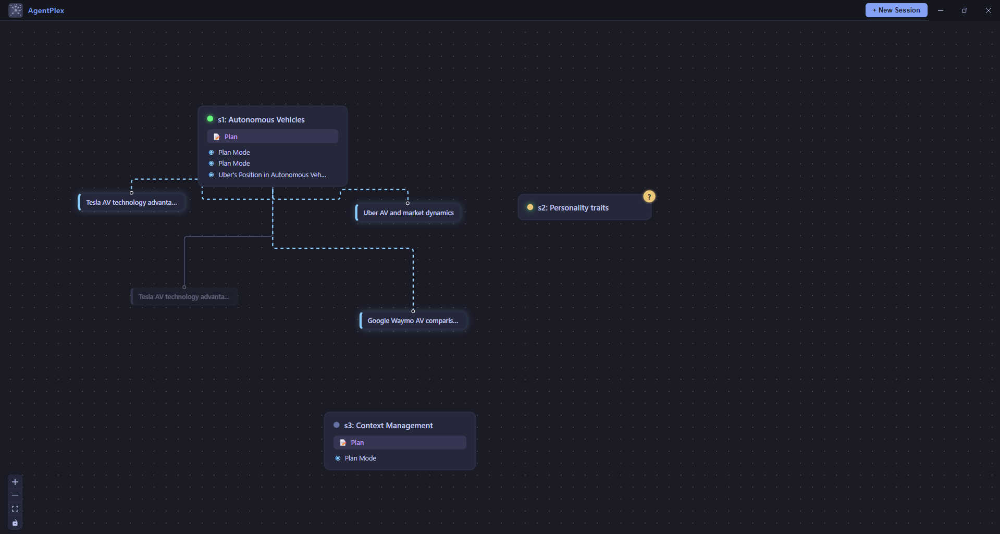

<p align="center">
  
</p>

<h1 align="center">AgentPlex</h1>

<p align="center">
  Multi-session Claude/Codex/GitHub CLI orchestrator with graph visualization.
</p>

---

## Quick Start

### Prerequisites

- [Node.js](https://nodejs.org/) 18 or later
- [Claude CLI](https://docs.anthropic.com/en/docs/claude-cli) installed and authenticated

### Installation

```bash
git clone https://github.com/AlexPeppas/agentplex.git
cd agentplex
npm install
npm start
```

### Global Shortcut (optional)

Install a global `agentplex` command:

```bash
npm link        # one-time setup
agentplex       # launch from anywhere
```

To remove it later: `npm unlink -g agentplex`

## Features

- **Multi-session management** — run multiple Claude/Codex/GH CLI sessions side by side
- **Graph canvas** — drag, arrange, and connect session nodes on a visual canvas
- **HITL notifications** — get notified when a CLI session requires human input
- **Cross-session messaging** — send messages between sessions with context summary for continuation
- **Sub-agent tracking** — visualize spawned sub-agents via JSONL transcript tailing (no regex parsing)
- **Plan & task visualization** — see plans and task lists rendered in the graph
- **Session resume** — resume previous Claude sessions with `claude --resume`
- **Dark / light mode** — warm terracotta palette with theme toggle
- **Inline rename** — double-click any node to rename it

<p align="center">
  
</p>

> Three concurrent sessions on the graph canvas: **s1** researching autonomous vehicles with spawned sub-agents (Tesla, Uber, Waymo) and an active plan. The fading sub-agent has finished work and it will dissapear shortly, **s2** waiting for human input (indicated by the **?** badge), and **s3** in plan mode for a separate context management task. Each node reflects real-time session status at a glance.
<br>
You can hover over any session and click the send button to instill the session's context summary and a prompt/instruction in another active session.

## Usage

1. **Create sessions** — click the "+" button to spawn a new Claude CLI session
2. **Arrange nodes** — drag session nodes freely on the canvas
3. **Rename** — double-click a node label to rename it
4. **Send messages** — use cross-session messaging to coordinate between agents

## Project Structure

```
agentplex/
├── src/
│   ├── main/                # Electron main process
│   │   ├── main.ts          # App entry point & window management
│   │   ├── session-manager.ts   # PTY session lifecycle
│   │   ├── ipc-handlers.ts      # IPC bridge between main & renderer
│   │   ├── jsonl-session-watcher.ts # JSONL transcript tailing for sub-agent detection
│   │   └── plan-task-detector.ts # Plan & task list parsing
│   ├── preload/
│   │   └── preload.ts       # Context bridge for renderer
│   ├── renderer/
│   │   ├── App.tsx           # Root React component
│   │   ├── store.ts          # Zustand state management
│   │   ├── components/       # UI components
│   │   │   ├── GraphCanvas.tsx   # React Flow canvas
│   │   │   ├── SessionNode.tsx   # Session graph node
│   │   │   ├── SubAgentNode.tsx  # Sub-agent graph node
│   │   │   ├── GroupNode.tsx     # Group container node
│   │   │   ├── SendDialog.tsx    # Cross-session messaging
│   │   │   ├── TerminalPanel.tsx # xterm.js terminal
│   │   │   ├── Toolbar.tsx       # Top toolbar
│   │   │   └── StatusIndicator.tsx
│   │   └── hooks/
│   │       └── useTerminal.ts    # Terminal lifecycle hook
│   └── shared/               # Shared utilities
│       ├── ansi-strip.ts
│       └── ipc-channels.ts
├── styles/
│   └── index.css             # Global styles
├── bin/
│   └── agentplex.js          # CLI entry point
└── package.json
```

## Tech Stack

| Layer | Technology |
|-------|-----------|
| Desktop shell | [Electron](https://www.electronjs.org/) |
| UI framework | [React](https://react.dev/) |
| Graph canvas | [React Flow](https://reactflow.dev/) |
| Terminal | [xterm.js](https://xtermjs.org/) |
| State | [Zustand](https://zustand-demo.pmnd.rs/) |
| PTY backend | [node-pty](https://github.com/microsoft/node-pty) |

## Contributing

See [CONTRIBUTING.md](CONTRIBUTING.md) for guidelines.

## License

[MIT](LICENSE)
