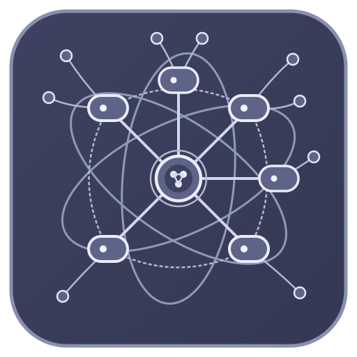
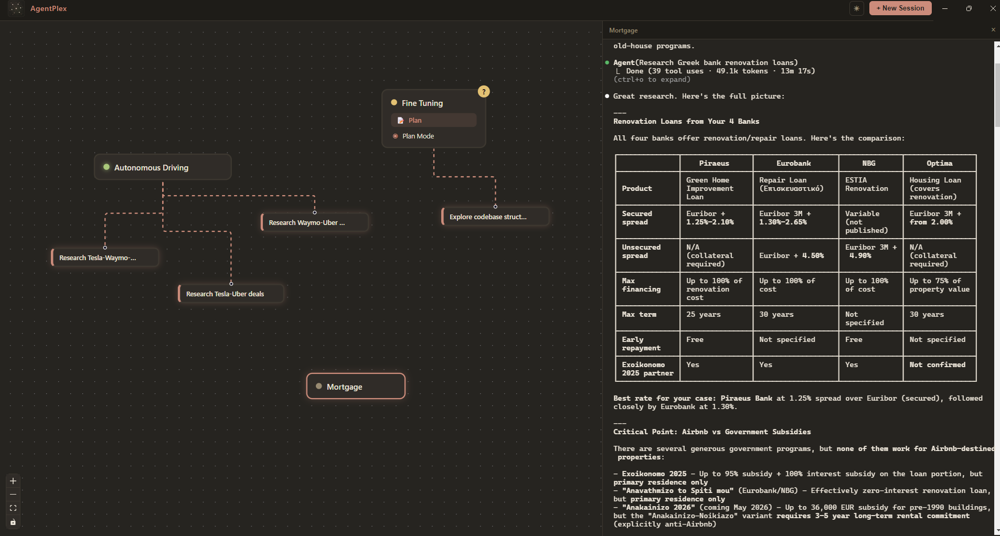

<p align="center">
  
</p>

<h1 align="center">AgentPlex</h1>

<p align="center">
  Multi-session Claude/Codex/GitHub Copilot CLI orchestrator with graph visualization.
</p>

<p align="center">
  <a href="https://github.com/AlexPeppas/agentplex/releases/latest"><strong>Download for Windows</strong></a> &nbsp;|&nbsp;
  <a href="#build-from-source">Build from source</a>
</p>

---

## Requirements

- [Claude CLI](https://docs.anthropic.com/en/docs/claude-cli) installed and authenticated
- [GitHub CLI](https://cli.github.com/) with Copilot extension (`gh copilot`) installed and authenticated

## Quick Start

Download **AgentPlex.exe** from the [latest release](https://github.com/AlexPeppas/agentplex/releases/latest) and run it. That's it.

> **macOS / Linux**: Pre-built binaries coming soon. For now, [build from source](#build-from-source).

## Installation

<a id="build-from-source"></a>

If you prefer to build from source instead of using the installer:

```bash
git clone https://github.com/AlexPeppas/agentplex.git
cd agentplex
pnpm install
pnpm start
```

To build a distributable installer:

```bash
pnpm make
```

### Global CLI shortcut (optional)

```bash
pnpm link --global   # one-time setup
agentplex            # launch from anywhere
```

To remove: `pnpm unlink --global agentplex`

## Dev Requirements

Building from source requires [Node.js](https://nodejs.org/) 20.19+ (20.x) or 22.12+ and native build tools for `node-pty`:

- **Windows**: [Visual Studio Build Tools](https://visualstudio.microsoft.com/visual-cpp-build-tools/) with "Desktop development with C++"
- **macOS**: `xcode-select --install`
- **Linux**: `sudo apt install build-essential python3`

pnpm is pinned via `packageManager` in package.json. If you have [corepack](https://nodejs.org/api/corepack.html) enabled (`corepack enable`), it will auto-install the correct version. Otherwise install pnpm directly: `npm install -g pnpm`.

## Features

- **Multi-session management** — run multiple Claude/Codex/Copilot CLI sessions side by side
- **Graph canvas** — drag, arrange, and connect session nodes on a visual canvas
- **HITL notifications** — get notified when a CLI session requires human input
- **Cross-session messaging** — send messages between sessions with optional Haiku-powered summarization
- **Sub-agent tracking** — visualize spawned sub-agents via JSONL transcript tailing
- **Plan & task visualization** — see plans and task lists rendered in the graph
- **Session resume** — resume previous Claude and Copilot sessions from the same launcher UX
- **External session adoption** — discover and adopt running Claude/Copilot sessions
- **Dark / light mode** — warm terracotta palette with theme toggle
- **Inline rename** — double-click any node to rename it

<p align="center">
  
</p>

> Three concurrent sessions on the graph canvas: **Autonomous Driving** spawned 3 sub-agents comparing Tesla, Waymo, and Cruise. **Fine Tuning** is in plan mode working through a structured research plan — it's currently waiting for human input (indicated by the **?** badge). **Mortgage** crawls and looks for the best interest rates. Each node reflects real-time session status at a glance. Hover any session and click the send icon to share context with another session.

## Configuration

### Cross-session summarization (optional)

To enable AI-powered context summarization when sending messages between sessions, set your Anthropic API key using `AGENTPLEX_API_KEY` (not `ANTHROPIC_API_KEY`, which would conflict with Claude CLI's auth).

**Set it persistently (recommended):**

```bash
export AGENTPLEX_API_KEY=sk-ant-...       # macOS/Linux (~/.bashrc or ~/.zshrc)
set AGENTPLEX_API_KEY=sk-ant-...          # Windows (cmd)
$env:AGENTPLEX_API_KEY="sk-ant-..."       # Windows (PowerShell)
```

**Or inline when launching from source:**

```bash
AGENTPLEX_API_KEY=sk-ant-... pnpm start                          # macOS/Linux
$env:AGENTPLEX_API_KEY="sk-ant-..."; pnpm start                  # Windows (PowerShell)
```

Without this, cross-session messaging still works — it sends raw context instead of a summary.

## Usage

1. **Create sessions** — click "+ New Session" and pick a working directory
2. **Arrange nodes** — drag session nodes freely on the canvas
3. **Rename** — double-click a node label to rename it
4. **Send messages** — hover a node, click the send icon to share context with another session
5. **Resume** — use "Resume" under Claude or Copilot to continue a previous session

The Explorer also provides a **Needs attention** box for sessions waiting for input.
Click an item to review its terminal; this does not automatically approve requests.
Search by session name, project path, CLI, or group, and combine status and CLI
filters. Projects and sessions stay alphabetically ordered as activity changes.
Session creation remains in the main toolbar and project context menus.

For Copilot, **Running** follows assistant turns and tool execution, **Needs
attention** means an unresolved permission or `ask_user` request, and **Idle**
means the turn has ended or been cancelled. Terminal prompt text, redraws, and
quiet periods during long-running work do not change Copilot's lifecycle status.

Copilot token readings are labeled **snapshot**: they come from the main
conversation's prompt-cache checkpoint, successful compaction, or CLI shutdown.
Hover for the exact count, source, and timestamp. Auxiliary model calls are
excluded. These snapshots can lag `/context`; no pressure percentage is shown
without a reliable context-window capacity.

Terminal fullscreen and split-pane resizing preserve the mounted terminal.
Desktop resizes wait for settled layout and queued output before synchronizing
the PTY and repainting. Windows PTY compatibility travels with each session so
desktop and web viewers use the host's scrollback behavior.

### Local WebSocket recovery

The local `/ws` API closes slow subscribers with code **1013** when their queued
output exceeds 1 MiB. It never silently resumes after dropping terminal or
lifecycle events. On this close, clients must mark their cached stream/state
stale, reconnect and resubscribe, then reload the authenticated
`GET /api/v1/sessions` catalog and needed session buffers. Terminal buffers are
bounded replay windows, not complete transcripts. Healthy subscribers are
unaffected; an unresponsive closing socket is terminated after one second.

### Plex coordinator POC

The **Plex** toolbar button opens a docked right-hand chat pane. Plex is an
application-owned orchestration harness: each conversation mounts one workspace
and a snapshot of one Squad blueprint, with separate coordinator and worker
histories. Copilot provides reasoning and execution; deterministic services own
permissions, approval, message identity, queue delivery and process affinity.

1. Install a current **GitHub Copilot CLI** supporting JSONL output,
   `--available-tools` and the SDK session API. Authenticate with `gh auth login`
   or supply `COPILOT_GITHUB_TOKEN` (`GH_TOKEN` / `GITHUB_TOKEN` also work).
   Plex uses the native install in `~/.local/bin`, the Windows `gh copilot`
   cached executable, or `copilot` on PATH. Every role uses Copilot, including
   planning, workers, and synthesis. There is no Claude fallback.
2. Open **Squads → New Squad blueprint**. Give the squad a name and add 1-4
   agents with names, short routing descriptions, optional instructions and
   checked tools. Save the blueprint. Templates/manual template launching have
   been removed from the UI and IPC.
3. Open **Plex → New chat**, choose the blueprint, then **Choose folder and
   create chat**. Mounting makes no model call. Ask, for example:
   "Explain this project's architecture and identify missing tests. Return
   findings with file references; do not modify anything."
4. Review tasks, acceptance criteria, selected agents, mounted cwd and their
   tool permissions. **Approve plan** publishes assignments; **Reject plan**
   publishes nothing. Typing "approved" in chat is not authorization.
5. Select another conversation or create a new one while work runs. The chat
   selector shows background phases; the canvas shows the selected conversation's
   agent instances. Returning to a chat restores its history and current tasks.
   **Cancel current request** affects only that conversation, not other chats
   or your existing PTYs.

#### Blueprints, capabilities and conversation identity

The supported Windows Copilot tool catalogue is `view`, `glob`, `rg` (content
search), `create`, `edit`, and `powershell`. Read tools are selected by default.
The catalogue is deliberately bounded, not an enumeration of all provider/MCP
tools. These names and write/shell execution were checked against the installed
native CLI. Unsupported tool selections are rejected, never silently granted.
The selected tools drive both the model's resource list and CLI
`--available-tools`/permission flags. No tools selected means reasoning only.

**Shell is full local-user execution**, including filesystem changes and network
access; a cwd mount is not an OS sandbox. `create`/`edit` allow workspace changes.
Use trusted workspaces and approve those capabilities deliberately. Blueprint
descriptions and instructions cannot enlarge the runtime tool allowlist.
Existing chats retain their blueprint revision even after that blueprint is
edited or deleted. Start a new chat to mount a different cwd or revision.

Each chat gets a `conversationId` and stable root `jobId`. Ingress messages
carry a distinct `messageId` (retained on delivery retry); assignments carry
their own `assignmentId`. The deterministic multiplexer resumes an agent
instance keyed by the conversation root job, squad ID and blueprint agent ID.
The same Architect blueprint in two chats therefore uses two independent CLI
conversations, which may run in parallel. Follow-ups in the same chat reuse the
same instance. Names are routing descriptions, not identity keys.
Every worker subprocess starts with the conversation's mounted directory as
its actual process `cwd`, on both creation and resume, not the CLI history
directory. The multiplexer rejects mismatched, missing or redirected mounts;
restoration rejects worker records whose cwd differs from the conversation.

The harness persists ingress receipts before invoking the coordinator. Identical
retries reuse the receipt; conflicting payloads with the same key are rejected.
Interrupted receipts are not automatically replayed after restart. Approval is
bound to the conversation and a generated plan token; a stale token cannot
approve a replacement plan. Model-generated plans are schema-checked and may
only target instances registered in the mounted conversation.

#### Broker contract

```text
Copilot coordinator -> approved plan -> RabbitMQ direct exchange
                                             |
                   one durable inbox per Copilot worker
                                             |
                 consume, claim locally, resume conversation
                                             |
            RabbitMQ results queue: completed / blocked + evidence
                                             |
               persist in ledger -> status query and synthesis
```

`propose_plan` describes the jobs and dependencies; approval gates publication.
Only a validated plan shows **Approve plan** and **Reject plan**.
Typing approval in chat does not authorize execution. Planning errors leave no
plan awaiting approval; correct the error and resend the request. Only the
mounted blueprint's agent instances are offered to the coordinator.
`assign_task` is represented by a broker job targeted to a worker, not a direct
model invocation. Each worker runtime subscribes to its own RabbitMQ queue
with prefetch 1 and an exclusive consumer, atomically claims the delivered job
in the local ledger, then starts its Copilot invocation. Idle consumers do not
make model calls. Claims carry a unique token and a 30-second lease renewed
every five seconds. Only the claim owner can publish a result. Identical
duplicate submissions return the existing result; conflicting or stale results
are rejected. A worker can explicitly return **blocked**, including why it
needs help, without pretending its job completed.

There is **one job publisher: Plex**, and N worker subscribers. Jobs are targeted,
not broadcast to every worker. The coordinator sees registered names,
descriptions, workspaces, status, and actual permitted tools. It selects an
agent ID semantically (for example, `dev-arch` for architecture review); the app
maps that ID to a stable queue. RabbitMQ does not perform semantic matching.
Queue names depend on the local Plex home and worker ID, not display names.
Each conversation has a durable inbox per agent instance, not per display name.
The envelope includes conversation/root job, message, assignment, squad and agent
identities. The multiplexer validates affinity before executing a subprocess.

Each chat retains one coordinator conversation for
planning and synthesis; each worker retains its own private Copilot conversation
across jobs and missions. Each conversation processes only one turn at a time.
The broker carries assignments/results, not shared conversation history.

Jobs and result items have separate IDs and are scoped to a mission. The broker
persists a terminal job transition and its result item together. Dependent jobs
run only after prerequisites complete; blocked prerequisites transitively block
dependents. Exceptions, cancellation, expired leases, and restart interruptions
produce blocked result items. They are not automatically retried. Completion
means a worker submitted a result, **not independently verified success**.

RabbitMQ owns delivery; a **single-owner ledger in Electron's main process**
owns job state, dependency readiness, claims and accepted results. The
coordinator publishes only dependency-ready jobs, reserving at most two slots
per chat. Different chats can execute concurrently.
Both asks and results use durable queues, persistent messages and publisher
confirms. A worker acknowledges its ask only after publishing its result with
confirmation; the result consumer acknowledges only after committing the result
to the ledger. Duplicate terminal deliveries are acknowledged without another
model call; result submissions are idempotent. Invalid messages are dead-lettered
to the local namespace's `.dead` queue and fail the mission visibly.

Connection loss interrupts the mission; it does not silently fall back to direct
execution or automatically replay work. Restart recovery still marks uncertain
ledger jobs blocked; old deliveries for terminal jobs are drained when consumers
next subscribe. Queues are retained between missions and are not auto-deleted.
The POC does not claim exactly-once execution.

#### Live activity, worker inspection and model selection

Plex streams public assistant response deltas, tool calls/results, and thinking
status while planning, executing and synthesizing. Private reasoning text is
not displayed. Worker activity travels through the claimed RabbitMQ assignment;
the local brain streams directly to its conversation. Updates are batched at
100 ms and bounded to the latest 100 entries / 64,000 text characters per stream.
The full workspace is not rewritten to disk for each token.

Click a **worker node on the graph** to open its independent read-only chat pane.
Worker activity is not rendered inline in Plex's conversation. The worker pane
stays bound to that worker even when you select another Plex conversation.
It combines live public activity with that worker's isolated CLI event log,
refreshing the log every second while open. Inspection never
resumes, attaches to, sends input to, or starts the worker. The preview reads
the latest 512 KB and indicates truncation; original CLI history stays on disk.
Inspection rejects agent IDs belonging to a different Plex conversation.

#### Talking to Plex while workers run

Plex accepts messages while workers execute or wait for permission. It can
answer directly or route a refinement to an active worker. Its own brain turns
remain serialized; final synthesis waits for an ongoing conversational turn.

Workers use the Copilot SDK's native CLI transport and immediate steering,
not terminal input injection or a replacement subprocess. Steering retains
the same conversation, mounted cwd, model and checked tools. Follow-ups within
the approved capabilities need no second plan approval. Plex may also queue
new assignments for mounted squad members within the same approved goal and
tool permissions. Expanded scope or different permissions still requires human
input rather than implicit authorization.

Each worker has a separate durable `.control` queue so its unacknowledged
assignment cannot block steering. The multiplexer verifies the mission,
assignment, worker identity and live claim before delivery. Durable receipts
distinguish pending, delivering, accepted and failed requests. **Accepted means
the CLI acknowledged the message**, not that it completed the requested change.
The CLI decides when to consume steering; a message racing the end of a turn
is drained before its runtime shuts down. Delivery uncertainty is reported,
never automatically retried. Restart recovery does not replay uncertain
steering. Cancelling a request aborts both its brain turn and its workers,
without cancelling other conversations.

#### Autonomous squad coordination

Approving the purple-highlighted plan also authorizes follow-on work toward
that goal using the displayed mounted squad and its existing tools. Workers
can use `ask_user` to ask **Plex first**. The native SDK callback remains bound
to the originating live assignment; the host validates its claim, records the
question, and serializes the answer through that conversation's Plex brain.
This is local host coordination, not a distributed question-consumer service.
Assignments and permission decisions continue to use RabbitMQ.

Plex answers routine questions from the approved goal and known context. It can
queue independent helper work, and reviews results after a batch finishes to
dispatch necessary follow-on assignments without another plan approval.
Dependency readiness, the two-worker concurrency limit, and mounted cwd,
model and tools still apply. Earlier job IDs/results remain in the same mission;
follow-on jobs resume the same worker histories. New tasks have new IDs.

Ambiguous intent, unknown facts, expanded scope, sensitive/irreversible actions
not already authorized, and explicit permission requests must go to the human.
Worker question failures also escalate visibly rather than fabricating answers.
Human questions appear only in the originating Plex chat, with choices or a
free-text answer; routine questions/answers are recorded in the worker view,
not copied into the main chat. Questions time out after ten minutes and are
interrupted, not replayed, on cancellation or restart.

The host enforces identity, tools and task-graph limits; whether a proposed
implementation step is semantically within the goal remains a model judgment,
not an OS security boundary. There is a safety ceiling of 100 assignments and
100 worker questions per mission, with at most six tasks in each new batch.
Provider credit limits still apply; this is not unlimited unattended execution.

Blueprint agents have a **Copilot model** picker populated from the installed,
authenticated CLI using ACP initialization and an empty session (no prompt or
tool execution). Discovery errors are displayed and can be retried with
**Refresh models**; there is no hard-coded model list. **CLI default** leaves
selection to Copilot. Explicit model IDs are snapshotted at mount and supplied
on every new/resumed worker turn; changing a blueprint does not alter old chats.

Plan approval/rejection produces a durable system receipt and a structured
decision supplied to subsequent brain prompts and result synthesis. Rejecting
does not invoke an extra model turn or publish worker jobs. A stale rejection
cannot cancel an already approved request. Model prose alone cannot create a
plan: empty task lists have no approval card, and the UI explicitly distinguishes
previous blocked/cancelled assignments from a pending proposal.

Main-process changes require restarting AgentPlex. Renderer hot reload alone
does not register new IPC handlers or update already running subprocess adapters.

#### Worker permission requests

Worker subprocesses reuse the Copilot `JsonlSessionWatcher`, watching only new
events in that instance's isolated `COPILOT_HOME` (including a final drain on
exit). Structured `permission.requested` and `permission.completed` events
travel over RabbitMQ's results queue with the assignment's worker/claim
identity. The ledger stores each request idempotently and updates the originating
Plex chat, never the currently selected unrelated chat.

A pending request appears as an **Action required** card with the agent,
request ID and any action/resource/command details supplied by Copilot. The
chat selector and worker node show `waiting-for-approval`; a link in other chats
opens the affected conversation. Missing provider details are identified, not
guessed from terminal output.

**Plan-level preapproval remains the default:** approving the plan authorizes
its checked tool categories, so ordinary operations need no second click.
Additional or provider-required permissions appear on the card with
**Approve once** and **Deny**. Approve once applies only to that request; Deny
returns a refusal to the worker, which can report the task blocked or continue
without that action. Neither changes the blueprint or grants future permissions.
Managed requests requiring an explicit user decision are never auto-approved.
Routine preapproved permission events are filtered before publication, avoiding
spurious waiting states and repetitive cards. Older resolved provider-only
records are hidden from the chat; explicit human decision receipts remain visible.

Decisions travel through the worker's RabbitMQ `.control` queue to the same
running CLI's typed SDK permission API, not stdin. Conversation, assignment,
claim and permission IDs are checked before delivery. The ledger records the
decision before publishing and marks it accepted only after the provider
acknowledges applying it. Acceptance is not assignment completion. Stale,
duplicate and conflicting decisions are rejected. Failed or timed-out delivery
is shown explicitly; uncertain decisions are not automatically retried or
replayed after restart. Use **Cancel this conversation request** to stop the
request's jobs without affecting other chats.

An explicit permission or worker question pauses the one-hour worker execution budget and
starts a separate ten-minute wait deadline. Worker heartbeats and ownership
continue, so waiting cannot trigger another worker execution. Completion events
resume execution timing but do not imply approval; a successful-looking CLI
exit with unresolved requests is treated as blocked. Cancellation, timeout or
restart marks pending cards interrupted, retaining the record without replay.
No structured event means no approval card: an otherwise unresponsive process
still reaches the normal execution timeout.

Run one AgentPlex instance against this home directory. Consumer runtimes and
the authoritative ledger still live in that process: RabbitMQ messages reference
local job IDs, so this is not yet a distributed worker deployment. Broker
credentials are application-level, not separate per-worker security identities.

#### Local RabbitMQ setup

RabbitMQ must be running before approving a plan. Without it, approval fails
explicitly and no worker executes. `PLEX_RABBITMQ_URL` defaults to
`amqp://localhost:5672` (RabbitMQ's local default credentials). For a dedicated
broker with Docker Compose, set a password in the launching PowerShell:

```powershell
$env:PLEX_RABBITMQ_PASSWORD = Read-Host 'Dedicated local RabbitMQ password'
docker compose -f compose.plex-rabbit.yml up -d --wait
$env:PLEX_RABBITMQ_URL = 'amqp://plex:' + [uri]::EscapeDataString($env:PLEX_RABBITMQ_PASSWORD) + '@localhost:5672'
pnpm start
```

Start/restart AgentPlex yourself with that environment; starting the broker
does not restart the app. The compose service binds only to `127.0.0.1`,
persists data in a dedicated Docker volume, and has no management port exposed.
The initial password initializes a new volume; changing the environment does
not change credentials in an existing volume. Do not commit credentials.
Non-loopback broker URLs require `amqps:` with certificate verification.
RabbitMQ traffic is not the cloud mirror's E2EE transport; keep this broker
local for the POC.

For older RabbitMQ versions that enforce acknowledgement timeouts on classic
queues, configure the broker's `consumer-timeout` policy above the intended
worker duration including input waits; its historical 30-minute default is too
short for hour-long jobs. RabbitMQ 4.3 classic queues (used by the local POC)
do not impose that delivery timeout. Worker claim heartbeats remain active.

Limits: one active mission per chat (with conversational follow-ups and active-worker
steering), 1-4 Copilot agents per mounted blueprint,
six tasks per batch and two concurrent workers per chat. No global
cross-chat concurrency budget is imposed yet. Worker invocations have a one-hour
active execution budget; coordinator model turns retain a four-minute timeout.
Plex does not impose an AI-credit ceiling; provider/account limits still apply.
Existing Plex-owned sessions with the old cumulative 30-credit cap have that
limit cleared through the provider's session-options API before continued work,
without replacing their IDs or deleting history. Coordinator migration is a
bounded, no-prompt configuration step, recorded only after provider success.
A six-task mission without follow-ups uses
at most eight invocations including planning and synthesis. Conversational
follow-ups and steering incur additional model usage. Workspace content is processed through Copilot.
Worker tools are restricted to the mounted agent's checked tools.
The Plex brain runs in the conversation's mounted CWD with `view`, `glob`, `rg`,
`create`, `edit`, `powershell` and PowerShell session-management tools by default.
It can inspect, edit and run commands directly, while delegating substantial or
parallel work to the squad. These tools are preapproved, including writes and
shell commands with local user privileges; the CWD is not a sandbox.
Worker tool selections and worker-plan approval gates remain separate and unchanged.
The brain also has `web_search`, `web_fetch`, and read-only `session_store_sql`
history queries, including planning, follow-ups and synthesis.
Web URLs and the built-in GitHub MCP server's `web_search` tool are preapproved
for the brain; no other GitHub operations are added.
`/chronicle <question>` in Plex chat uses the history
query tool, not the interactive CLI command UI. History availability follows
Copilot's authenticated account and isolated local home; this does not import
other local CLI homes. Existing chats gain these defaults on their next turn
without changing their session identity or mounted worker tools.
Per-agent persistent `COPILOT_HOME`
directories disable hooks and avoid inheriting user MCP servers or overwriting
the hosting CLI's config. Workers disable built-in MCPs; the brain exposes only
GitHub's web-search tool. Custom instructions are disabled for both.
Credentials are passed through the child environment, not arguments or stored
in the ledger. This is **not an OS sandbox**: use trusted workspaces.

The workspace registry, blueprints, mounts and ingress receipts are stored in
`~/.agentplex/plex/workspace.json`. Each chat has its own
`~/.agentplex/plex/chats/<conversationId>/state.json`, `broker.json` and
`conversations/` directory. The broker ledger is authoritative for assignments
and results; CLI homes retain actual model history.

On first use, compatible legacy `templates.json` entries are imported as
read-only blueprints. Workspace and old CLI session IDs are not imported.
Mixed-provider/oversized entries are skipped with visible migration notes.
The original file remains unchanged. Earlier `plex-poc` chat/queue/history files
are also retained untouched: their multi-workspace history is not silently
rebound to a new mounted chat. No background work is replayed by migration.
Workers are logical agent instances with RabbitMQ consumers backed by bounded
Copilot calls, not persistent PTYs. A new process resumes the same explicit
conversation ID on each subsequent job; it never selects the most recent
session or silently replaces missing history. Conversation manifests and CLI
history live in each chat's `conversations/` directory. They survive app
restart, although interrupted jobs are still blocked rather than replayed.
Normal Copilot
context compaction still applies; continuity does not imply unlimited context.
Existing interactive sessions are never commandeered, and conversation IDs
saved in Squad templates are not used by Plex. Arbitrary
interactive session adoption, independent result
verification, MCP transport, and web/voice control remain outside this POC.

Regression checks (fake AMQP, no model calls or running broker):
`node --test scripts\plex-harness.test.cjs scripts\plex-rabbit.test.cjs scripts\plex-broker.test.cjs scripts\plex-coordinator.test.cjs` and
`node scripts\plex-poc-smoke.cjs`.
`node --test scripts\plex-sdk.test.cjs scripts\plex-steering.test.cjs` covers
native steering lifecycle, concurrent conversation, cancellation and delivery
receipts without model calls.
`node --test scripts\plex-permission-decisions.test.cjs` checks permission
decision routing, persistence, isolation, cancellation and uncertain delivery.
`node scripts\plex-permission-smoke.cjs` exercises live Copilot approval and
denial over RabbitMQ against a temporary synthetic file. Its SDK test wrapper
requires host confirmation for that read regardless of local policy; production
plan preapproval remains unchanged. This smoke incurs Copilot usage.
`node --test scripts\plex-autonomy.test.cjs` covers routine questions, human
escalation, cancellation, serialized brain turns and autonomous follow-on jobs.
`node scripts\plex-autonomy-smoke.cjs` uses a real Copilot worker and RabbitMQ
with a deterministic test brain to verify native `ask_user`, answer delivery
and continued execution in the same worker. This smoke incurs Copilot usage.
`node --test scripts\plex-credit-limit.test.cjs` checks credit-cap migration and
provider diagnostics. `node scripts\plex-credit-limit-smoke.cjs` creates a
synthetic legacy capped session and verifies uncapped resume with history
recall intact; it incurs Copilot usage.
`node scripts\plex-brain-tools-smoke.cjs` verifies actual brain web search,
fetch and `/chronicle` history-query calls, including resume. It uses public
example-domain content and constant SQL queries, and incurs Copilot usage.
`node scripts\plex-brain-workspace-smoke.cjs` verifies actual brain filesystem
and shell execution in a synthetic mounted CWD, plus edits after exact-session
resume. It incurs Copilot usage.
`node scripts\plex-rabbit-smoke.cjs` exercises the real configured RabbitMQ with
synthetic workers, including two missions on the same queues, and removes only
its unique test namespace afterwards.
The optional `node scripts\plex-poc-smoke.cjs --live-mission` requires RabbitMQ
and exercises a mounted chat, planning, worker queues, results and synthesis
with a temporary synthetic fixture. Live modes incur Copilot usage.
`node scripts\plex-steering-smoke.cjs` checks real RabbitMQ control delivery and
native same-process Copilot steering against a synthetic sleep command,
including the provider message ID and the final refined answer.
`--live-conversations` verifies recall across two separate CLI processes using
one persistent conversation and a synthetic random marker.
`--live-routing` makes one coordinator planning call with synthetic consumer
profiles and checks selection of `dev-arch` for an architecture task, without
executing workers or requiring RabbitMQ.
`--live-tools` verifies `create`, `edit` and `powershell` on a synthetic file,
not on repository content.

## Project Structure

```
agentplex/
├── src/
│   ├── main/                # Electron main process
│   │   ├── main.ts          # App entry point & window management
│   │   ├── session-manager.ts   # PTY session lifecycle
│   │   ├── ipc-handlers.ts      # IPC bridge between main & renderer
│   │   ├── jsonl-session-watcher.ts # Claude/Copilot event tailing (sub-agent, plan, tasks, HITL)
│   │   ├── plan-task-detector.ts # Claude terminal parsing for plan/tasks
│   │   ├── claude-session-scanner.ts # Claude project/session discovery + transcript rendering
│   │   └── copilot-session-scanner.ts # Copilot project/session discovery + transcript rendering
│   ├── preload/
│   │   └── preload.ts       # Context bridge for renderer
│   ├── renderer/
│   │   ├── App.tsx           # Root React component
│   │   ├── store.ts          # Zustand state management
│   │   ├── components/       # UI components
│   │   │   ├── GraphCanvas.tsx   # React Flow canvas
│   │   │   ├── SessionNode.tsx   # Session graph node
│   │   │   ├── SubAgentNode.tsx  # Sub-agent graph node
│   │   │   ├── GroupNode.tsx     # Group container node
│   │   │   ├── SendDialog.tsx    # Cross-session messaging
│   │   │   ├── TerminalPanel.tsx # xterm.js terminal
│   │   │   ├── Toolbar.tsx       # Top toolbar
│   │   │   └── StatusIndicator.tsx
│   │   └── hooks/
│   │       └── useTerminal.ts    # Terminal lifecycle hook
│   └── shared/               # Shared utilities
│       ├── ansi-strip.ts
│       └── ipc-channels.ts
├── styles/
│   └── index.css             # Global styles
├── bin/
│   └── agentplex.mjs         # CLI entry point
└── package.json
```

## Tech Stack

| Layer | Technology |
|-------|-----------|
| Desktop shell | [Electron](https://www.electronjs.org/) |
| UI framework | [React](https://react.dev/) |
| Graph canvas | [React Flow](https://reactflow.dev/) |
| Terminal | [xterm.js](https://xtermjs.org/) |
| State | [Zustand](https://zustand-demo.pmnd.rs/) |
| PTY backend | [node-pty](https://github.com/microsoft/node-pty) |
| Summarization | [Anthropic SDK](https://docs.anthropic.com/en/docs/sdks) (optional) |

## Contributing

See [CONTRIBUTING.md](CONTRIBUTING.md) for guidelines.

## License

[MIT](LICENSE)
