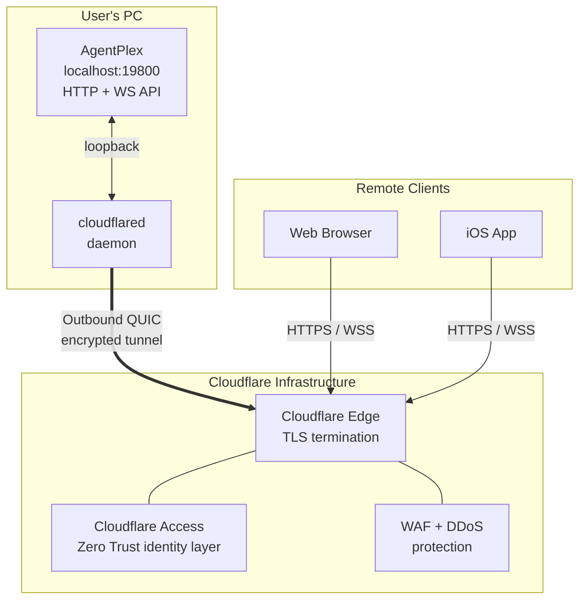
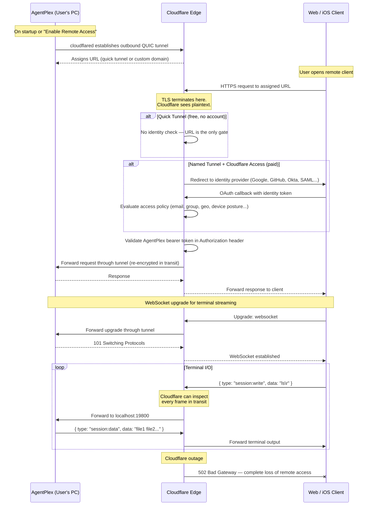

# Option A: Cloudflare Tunnel

Remote access to AgentPlex sessions via Cloudflare's tunnel infrastructure.

## Overview

Cloudflare Tunnel (`cloudflared`) creates an outbound-only encrypted connection from the user's machine to Cloudflare's edge network. Cloudflare assigns a public URL and proxies incoming requests back through the tunnel to the local AgentPlex API server (`localhost:19800`). No inbound ports, no firewall changes, no public IP required.

## Architecture



## Connection Flow



## Deployment Modes

### Quick Tunnel (zero config, free)

No Cloudflare account needed. `cloudflared` generates a random `*.trycloudflare.com` URL on each launch.

```
# AgentPlex spawns this as a child process
cloudflared tunnel --url http://localhost:19800
```

- URL changes every restart (e.g., `plex-abc123.trycloudflare.com`)
- No identity verification — anyone with the URL can reach the API
- AgentPlex bearer token is the only authentication layer
- Suitable for: personal use, quick demos, development

### Named Tunnel (persistent URL, requires account)

User creates a tunnel in the Cloudflare dashboard and maps it to a custom domain.

```
# One-time setup
cloudflared tunnel create agentplex
cloudflared tunnel route dns agentplex plex.yourdomain.com

# AgentPlex runs this on startup
cloudflared tunnel --config ~/.agentplex/cloudflared.yml run agentplex
```

Config file (`~/.agentplex/cloudflared.yml`):
```yaml
tunnel: <tunnel-uuid>
credentials-file: ~/.cloudflared/<tunnel-uuid>.json
ingress:
  - hostname: plex.yourdomain.com
    service: http://localhost:19800
  - service: http_status:404
```

- Stable URL (`plex.yourdomain.com`)
- Can add Cloudflare Access policies for identity-based auth
- Requires Cloudflare account (free tier sufficient for tunnel, Access requires paid plan for advanced policies)

### Cloudflare Access Integration

When paired with Cloudflare Access (Zero Trust), adds identity verification before traffic reaches the tunnel:

- OAuth/OIDC providers: Google, GitHub, Azure AD, Okta
- SAML integration for enterprise SSO
- Device posture checks (managed device, disk encryption, OS version)
- Geo-restrictions (allow only from specific countries)
- Session duration limits with re-authentication

## AgentPlex Integration Design

### User Experience

1. User opens AgentPlex Settings > Remote Access
2. Clicks "Enable Remote Access"
3. AgentPlex downloads `cloudflared` binary (or uses bundled copy)
4. Spawns `cloudflared tunnel --url http://localhost:19800`
5. Displays the generated URL + QR code
6. User opens URL on phone/browser, enters AgentPlex bearer token
7. Remote session management is live

### Implementation

```typescript
// src/main/remote/cloudflare-tunnel.ts

import { spawn, ChildProcess } from 'child_process';

let tunnelProcess: ChildProcess | null = null;
let tunnelUrl: string | null = null;

export async function startTunnel(localPort: number): Promise<string> {
  return new Promise((resolve, reject) => {
    tunnelProcess = spawn('cloudflared', [
      'tunnel', '--url', `http://localhost:${localPort}`,
      '--no-autoupdate',
    ]);

    tunnelProcess.stderr?.on('data', (data: Buffer) => {
      const line = data.toString();
      // cloudflared logs the URL to stderr
      const match = line.match(/https:\/\/[^\s]+\.trycloudflare\.com/);
      if (match && !tunnelUrl) {
        tunnelUrl = match[0];
        resolve(tunnelUrl);
      }
    });

    tunnelProcess.on('error', reject);
    tunnelProcess.on('exit', (code) => {
      if (!tunnelUrl) reject(new Error(`cloudflared exited with code ${code}`));
      tunnelUrl = null;
    });

    // Timeout if URL not received
    setTimeout(() => {
      if (!tunnelUrl) reject(new Error('Tunnel URL not received within 15s'));
    }, 15_000);
  });
}

export function stopTunnel() {
  if (tunnelProcess) {
    tunnelProcess.kill();
    tunnelProcess = null;
    tunnelUrl = null;
  }
}

export function getTunnelUrl(): string | null {
  return tunnelUrl;
}
```

### Binary Distribution

| Strategy | Pros | Cons |
|---|---|---|
| Bundle `cloudflared` in installer | Works offline, no download step | Adds ~30MB to installer, needs per-platform builds |
| Download on first use | Smaller installer, always latest version | Requires internet, first-use delay |
| Expect user to install | No maintenance burden | Friction, bad UX for non-technical users |

Recommendation: **download on first use** with a fallback prompt to install manually. Store in `~/.agentplex/bin/cloudflared`.

## Security Analysis

### Trust Model

```
Client <--TLS--> Cloudflare Edge <--QUIC tunnel--> cloudflared <--loopback--> AgentPlex
                       ^
                       |
              Cloudflare sees ALL
              traffic in plaintext
```

The critical security property: **Cloudflare terminates TLS**. This means Cloudflare's infrastructure has access to the plaintext content of every HTTP request, every WebSocket frame, and every terminal I/O byte that flows through the tunnel.

### What Cloudflare Can See

- Every command typed into remote sessions
- Every line of terminal output (including source code, API keys printed to stdout, file contents)
- Every git operation (diffs, commit messages, file contents via `git:saveFile`)
- Session metadata (which projects, working directories, session UUIDs)
- Authentication tokens in request headers

### Threat Matrix

| Threat | Risk Level | Mitigation |
|---|---|---|
| Cloudflare employee access to traffic | Low (SOC2, strict access controls) | Accept or don't use |
| Law enforcement subpoena to Cloudflare | Medium (varies by jurisdiction) | Cloudflare's transparency reports; no E2EE option |
| Cloudflare infrastructure compromise | Low probability, catastrophic impact | All tunneled traffic exposed |
| Quick tunnel URL guessing/scanning | Medium (URLs are random but discoverable) | Bearer token is the real gate; use named tunnels for production |
| Bearer token theft (MITM between client and CF edge) | Very low (CF's TLS is strong) | Standard browser TLS protections apply |
| Cloudflare outage | Medium probability | Complete loss of remote access; no fallback path |
| `cloudflared` binary compromise (supply chain) | Low | Pin versions, verify checksums |

### What This Architecture Cannot Provide

- **End-to-end encryption**: Impossible — Cloudflare is the TLS terminator by design
- **Data sovereignty**: Traffic routes through Cloudflare's global network; you don't control which regions
- **Audit log ownership**: Cloudflare has their own logs; you only see what they expose via API
- **Independence from third party**: Cloudflare outage = total remote access blackout

## Cost

| Tier | Tunnel | Access Policies | Custom Domain | Price |
|---|---|---|---|---|
| Free | Quick tunnel only | N/A | No | $0 |
| Free (with account) | Named tunnel | 50 users, basic policies | Yes | $0 |
| Teams | Named tunnel | Advanced policies, device posture | Yes | $7/user/month |
| Enterprise | Named tunnel | Full Zero Trust suite | Yes | Custom |

## Pros and Cons Summary

### Pros

- Zero configuration for end users (quick tunnel)
- No inbound ports, no firewall changes, no public IP needed
- Built-in DDoS protection and WAF
- Cloudflare Access provides enterprise-grade identity layer (paid)
- Stable, well-maintained infrastructure
- Free tier sufficient for personal use

### Cons

- **No end-to-end encryption** — Cloudflare sees all terminal I/O in plaintext
- Third-party dependency — Cloudflare outage kills remote access entirely
- Quick tunnel URLs are ephemeral (change on restart)
- Advanced access policies require paid plan
- No data sovereignty control
- Potential compliance issues for regulated industries (finance, healthcare, government)
- ~30MB binary dependency (`cloudflared`)

## Recommended Use Cases

| Use Case | Suitability | Notes |
|---|---|---|
| Personal dev machine, quick access | Excellent | Quick tunnel, bearer token is sufficient |
| Team demo / pair programming | Good | Named tunnel + Cloudflare Access |
| Production deployment to customers | Marginal | Lack of E2EE is a concern for terminal access |
| Enterprise / regulated environments | Poor | Compliance issues with third-party traffic inspection |
| iOS App Store distribution | Poor | Ephemeral URLs don't work; named tunnels add friction |
