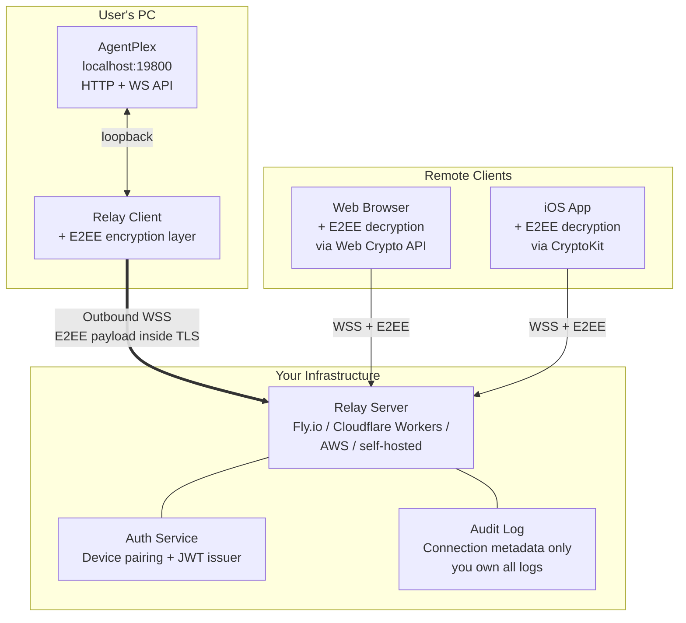
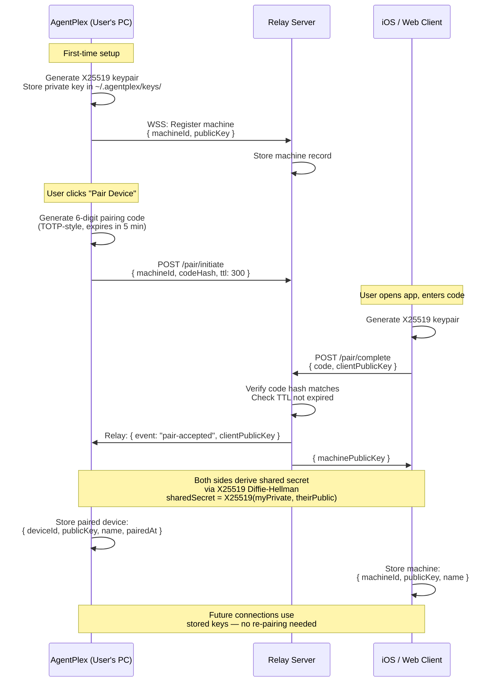
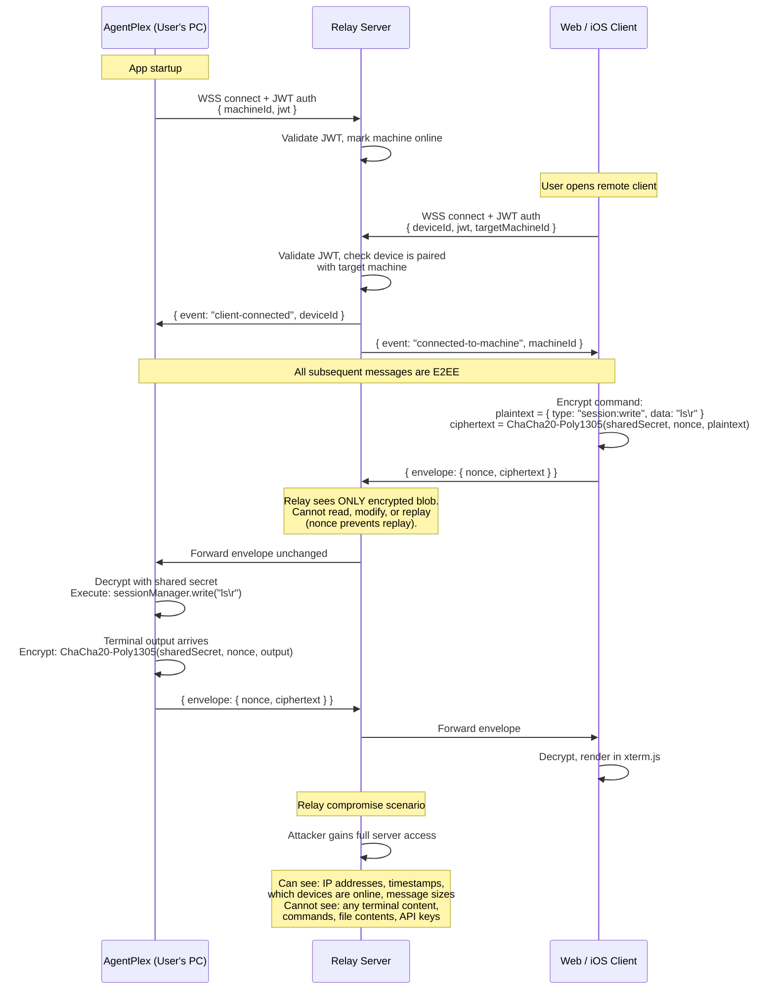
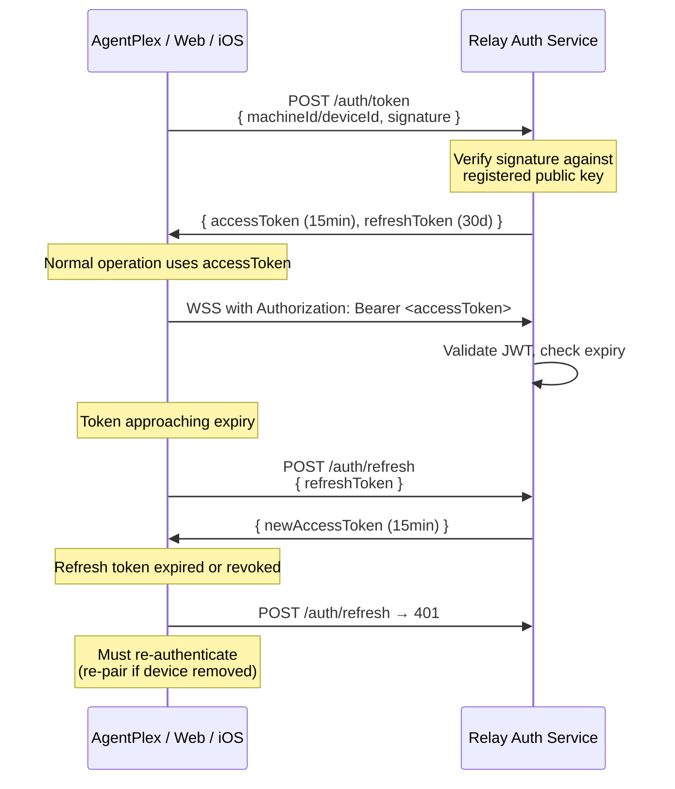
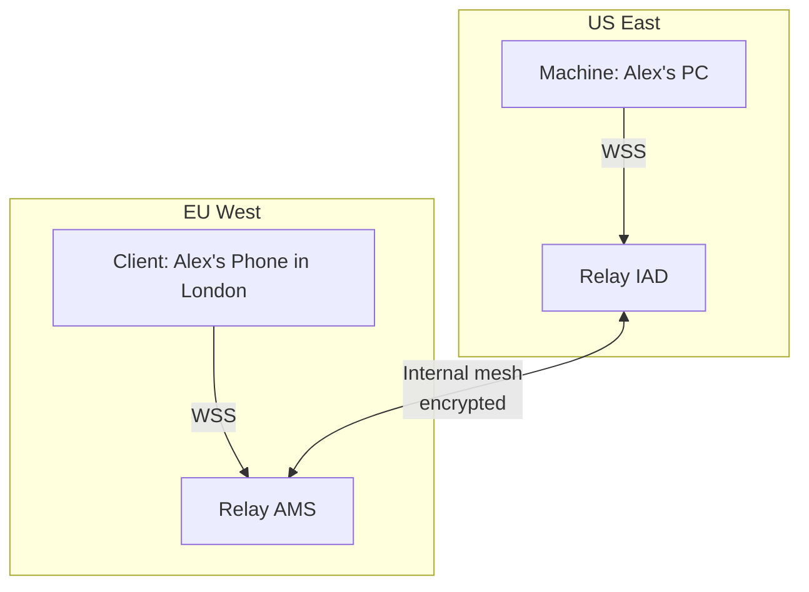
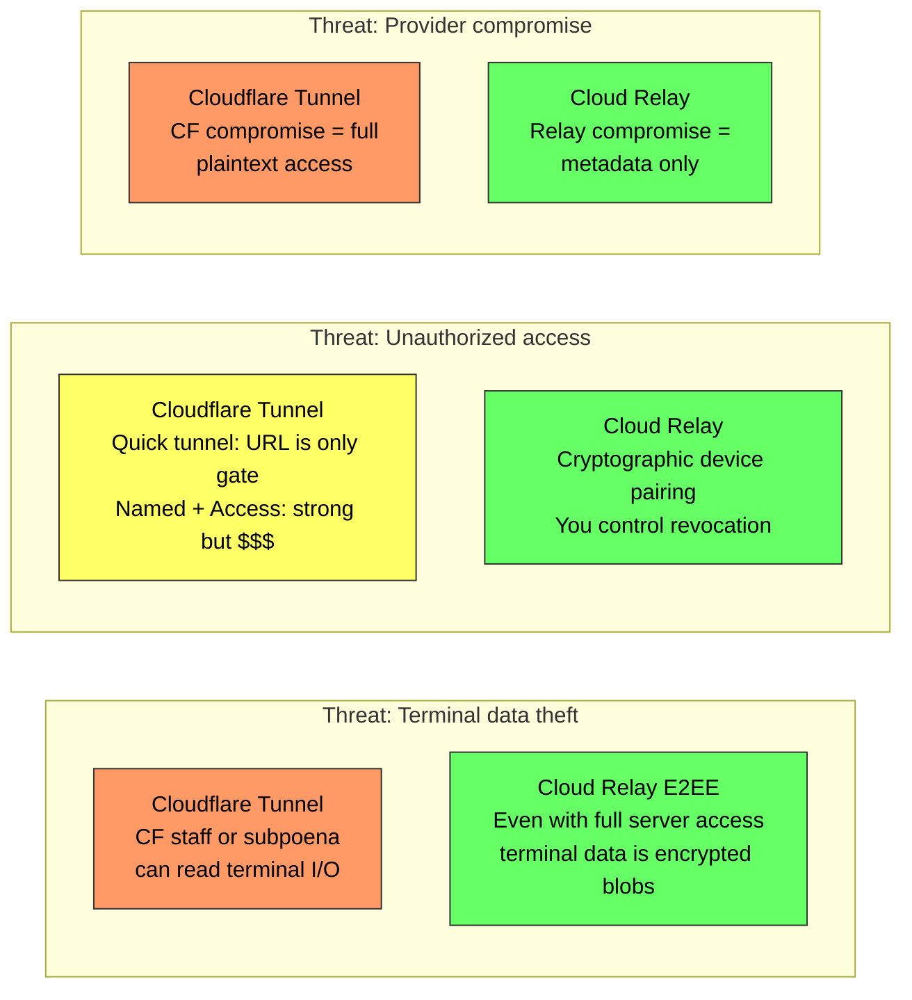

# Option B: Self-Hosted Cloud Relay with End-to-End Encryption

Remote access to AgentPlex sessions via a self-hosted relay server with end-to-end encryption. The relay is a blind pipe — it brokers connections but cannot read terminal data.

## Overview

AgentPlex opens an **outbound** WebSocket to a relay server you control. Remote clients (web browser, iOS app) also connect to the relay. The relay matches authenticated pairs and forwards encrypted blobs between them. All terminal I/O is encrypted client-side using X25519 key exchange + ChaCha20-Poly1305 before leaving the machine — the relay never sees plaintext.

## Architecture



## Connection Flow

### Device Pairing (one-time)



### Normal Session (after pairing)



### JWT Lifecycle



## Relay Server Design

### Tech Stack Options

| Option | Pros | Cons | Monthly Cost |
|---|---|---|---|
| **Cloudflare Workers + Durable Objects** | Global edge deployment, WebSocket support via Durable Objects, auto-scaling, no cold starts | Vendor-specific API, 128MB memory limit per DO | ~$5-25 (Workers Paid) |
| **Fly.io (Node.js / Go)** | Low latency (deploy close to users), persistent WebSocket, simple deployment | Need to manage instances, no auto-scale to zero | ~$5-15 (shared CPU) |
| **AWS Lambda + API Gateway** | Pay-per-use, scales to zero | WebSocket state management is painful, 15min execution limit | ~$1-10 |
| **Self-hosted VPS (Hetzner, DigitalOcean)** | Full control, cheapest at scale, no vendor lock-in | Must manage uptime, TLS certs, monitoring | ~$5-10 |

Recommendation: **Fly.io** for simplicity or **Cloudflare Workers + Durable Objects** for global edge performance.

### Relay Server Implementation (Node.js)

```
relay/
  src/
    index.ts            # HTTP + WebSocket server entry
    auth.ts             # JWT issuance, validation, refresh
    pairing.ts          # Device pairing flow (code generation, verification)
    relay.ts            # Message routing between machines and clients
    store.ts            # Machine/device registry (SQLite or KV)
    audit.ts            # Connection event logging
  Dockerfile
  fly.toml              # Fly.io deployment config
```

Core relay logic (~200 lines):

```typescript
// relay/src/relay.ts — conceptual sketch

interface Machine {
  machineId: string;
  ws: WebSocket;
  pairedDevices: Set<string>;
}

interface Client {
  deviceId: string;
  ws: WebSocket;
  targetMachineId: string;
}

class RelayServer {
  private machines = new Map<string, Machine>();
  private clients = new Map<string, Client>();

  onMachineConnect(machineId: string, ws: WebSocket) {
    this.machines.set(machineId, { machineId, ws, pairedDevices: new Set() });
    // Notify any waiting clients that this machine is online
  }

  onClientConnect(deviceId: string, targetMachineId: string, ws: WebSocket) {
    const machine = this.machines.get(targetMachineId);
    if (!machine || !machine.pairedDevices.has(deviceId)) {
      ws.close(4403, 'Not paired with target machine');
      return;
    }
    this.clients.set(deviceId, { deviceId, ws, targetMachineId });

    // Forward encrypted envelopes bidirectionally
    ws.on('message', (data) => machine.ws.send(data));     // client → machine
    machine.ws.on('message', (data) => ws.send(data));     // machine → client
  }
}
```

### Data Model

```
machines
  ├── machineId (UUID)
  ├── publicKey (X25519, base64)
  ├── displayName
  ├── registeredAt
  └── lastSeen

devices
  ├── deviceId (UUID)
  ├── publicKey (X25519, base64)
  ├── displayName
  ├── platform (ios | web | android)
  ├── pairedMachineId (FK → machines)
  ├── pairedAt
  └── lastSeen

audit_log
  ├── timestamp
  ├── event (connect | disconnect | pair | unpair | auth_failure)
  ├── machineId
  ├── deviceId
  ├── clientIp
  └── metadata (JSON)
```

## Encryption Design

### Key Exchange

Using X25519 (Curve25519 Diffie-Hellman) for key agreement:

```
Machine keypair:   (machinePrivate, machinePublic)     — generated once, stored locally
Device keypair:    (devicePrivate, devicePublic)        — generated once, stored on device

Shared secret:     X25519(machinePrivate, devicePublic)
                 = X25519(devicePrivate, machinePublic)   ← same value on both sides

Session key:       HKDF-SHA256(sharedSecret, salt="agentplex-e2ee-v1", info=sessionId)
```

### Message Encryption

Using ChaCha20-Poly1305 (AEAD cipher):

```
Encrypt:
  nonce     = crypto.randomBytes(12)              // 96-bit, unique per message
  plaintext = JSON.stringify(wsMessage)
  aad       = machineId + ":" + deviceId          // additional authenticated data
  { ciphertext, tag } = ChaCha20Poly1305.encrypt(sessionKey, nonce, plaintext, aad)

Wire format:
  { nonce: base64(nonce), ct: base64(ciphertext + tag) }

Decrypt:
  plaintext = ChaCha20Poly1305.decrypt(sessionKey, nonce, ciphertext, aad)
  wsMessage = JSON.parse(plaintext)
```

### Why ChaCha20-Poly1305 over AES-GCM

- Constant-time on all platforms (no timing side-channels without AES-NI)
- Available in Web Crypto API (browsers), Node.js crypto, and Apple CryptoKit
- Used by WireGuard, TLS 1.3, and Signal Protocol
- Slightly faster than AES-GCM on devices without hardware AES (older phones)

### Key Rotation

- Session keys are derived per-connection using HKDF with a unique session ID
- Even if one session key is compromised, past and future sessions remain secure (forward secrecy at the session level)
- For full forward secrecy, implement ephemeral X25519 key exchange per session (Double Ratchet, like Signal) — this is a future enhancement

## Security Analysis

### Trust Model

```
Client <--TLS--> Relay <--TLS--> AgentPlex
                   ^
                   |
          Relay sees ONLY:
          - Encrypted blobs
          - Connection metadata
          - Message sizes/timing
```

### What the Relay Can See (even if fully compromised)

- IP addresses of machines and clients
- Timestamps of connections and disconnections
- Which devices are paired with which machines
- Message sizes and frequency (traffic analysis)
- That communication is happening (but not what)

### What the Relay Cannot See

- Terminal commands or output
- File contents, API keys, source code
- Session IDs or working directories
- Git operations or diffs
- Anything inside the E2EE envelope

### Threat Matrix

| Threat | Risk Level | Mitigation |
|---|---|---|
| Relay server compromise | Low impact | E2EE — attacker gets metadata only, no plaintext |
| Relay operator (you) reads traffic | Impossible | You don't have the private keys; only endpoints do |
| Law enforcement subpoena to relay | Low impact | You can only provide metadata; terminal data is encrypted |
| Man-in-the-middle at relay | Impossible | AEAD encryption with authenticated data prevents tampering |
| Replay attacks | Impossible | Unique nonce per message, AEAD authentication |
| Device theft (paired phone) | Medium | Revoke device from AgentPlex desktop; rotate keys |
| Pairing code brute-force | Low | 6-digit code with 5-minute TTL, rate-limited to 5 attempts |
| Relay DDoS | Medium | Must handle yourself (Cloudflare proxy, rate limiting) |
| Private key extraction from machine | Medium | Store in OS keychain (Windows DPAPI, macOS Keychain, Linux secret-service) |

### What This Architecture Provides

- **End-to-end encryption**: Relay is a cryptographically blind pipe
- **Data sovereignty**: You choose where the relay runs (region, provider)
- **Full audit log ownership**: Every connection event logged in your infrastructure
- **Independence**: No third-party in the trust chain for data confidentiality
- **Compliance-friendly**: Terminal data never leaves the encrypted tunnel between endpoints

## AgentPlex Integration Design

### Client-Side (AgentPlex desktop)

```typescript
// src/main/remote/relay-client.ts — conceptual design

import { createCipheriv, createDecipheriv, randomBytes, createHash } from 'crypto';
import { WebSocket } from 'ws';

interface PairedDevice {
  deviceId: string;
  publicKey: Buffer;
  name: string;
  pairedAt: string;
}

export class RelayClient {
  private ws: WebSocket | null = null;
  private machineKeys: { publicKey: Buffer; privateKey: Buffer };
  private pairedDevices: Map<string, PairedDevice>;
  private sessionKeys: Map<string, Buffer>;   // deviceId → derived session key

  constructor(private relayUrl: string, private machineId: string) {
    // Load or generate machine keypair
    // Load paired devices from ~/.agentplex/paired-devices.json
  }

  connect() {
    this.ws = new WebSocket(this.relayUrl, {
      headers: { Authorization: `Bearer ${this.getJwt()}` },
    });

    this.ws.on('message', (raw) => {
      const msg = JSON.parse(raw.toString());

      if (msg.type === 'envelope') {
        // Decrypt E2EE message from a paired device
        const sessionKey = this.sessionKeys.get(msg.fromDeviceId);
        if (!sessionKey) return;

        const plaintext = this.decrypt(sessionKey, msg.nonce, msg.ciphertext, msg.fromDeviceId);
        const command = JSON.parse(plaintext);
        this.handleRemoteCommand(command);
      }
    });
  }

  /** Encrypt and send a message to a specific paired device */
  sendToDevice(deviceId: string, message: object) {
    const sessionKey = this.sessionKeys.get(deviceId);
    if (!sessionKey || !this.ws) return;

    const plaintext = JSON.stringify(message);
    const nonce = randomBytes(12);
    const ciphertext = this.encrypt(sessionKey, nonce, plaintext, deviceId);

    this.ws.send(JSON.stringify({
      type: 'envelope',
      toDeviceId: deviceId,
      nonce: nonce.toString('base64'),
      ct: ciphertext.toString('base64'),
    }));
  }

  private encrypt(key: Buffer, nonce: Buffer, plaintext: string, deviceId: string): Buffer {
    const aad = Buffer.from(`${this.machineId}:${deviceId}`);
    const cipher = createCipheriv('chacha20-poly1305', key, nonce, { authTagLength: 16 });
    cipher.setAAD(aad);
    const encrypted = Buffer.concat([cipher.update(plaintext, 'utf-8'), cipher.final()]);
    return Buffer.concat([encrypted, cipher.getAuthTag()]);
  }

  private decrypt(key: Buffer, nonceB64: string, ctB64: string, deviceId: string): string {
    const nonce = Buffer.from(nonceB64, 'base64');
    const ct = Buffer.from(ctB64, 'base64');
    const aad = Buffer.from(`${this.machineId}:${deviceId}`);
    const authTag = ct.subarray(-16);
    const ciphertext = ct.subarray(0, -16);
    const decipher = createDecipheriv('chacha20-poly1305', key, nonce, { authTagLength: 16 });
    decipher.setAAD(aad);
    decipher.setAuthTag(authTag);
    return Buffer.concat([decipher.update(ciphertext), decipher.final()]).toString('utf-8');
  }
}
```

### Device Management UI

AgentPlex desktop gets a "Paired Devices" panel in Settings:

```
┌─────────────────────────────────────────────┐
│  Paired Devices                             │
│                                             │
│  📱 Alex's iPhone         paired 2 days ago │
│     Last seen: 3 minutes ago    [Revoke]    │
│                                             │
│  🌐 Work Laptop (Chrome)  paired 1 week ago │
│     Last seen: 5 hours ago      [Revoke]    │
│                                             │
│  [+ Pair New Device]                        │
│                                             │
│  Shows 6-digit code:  847 291               │
│  Expires in 4:32                            │
└─────────────────────────────────────────────┘
```

## Relay Deployment

### Fly.io (recommended for getting started)

```toml
# fly.toml
app = "agentplex-relay"
primary_region = "iad"     # US East — change to nearest region

[http_service]
  internal_port = 8080
  force_https = true

[env]
  NODE_ENV = "production"
  JWT_ISSUER = "agentplex-relay"
```

```bash
fly launch --name agentplex-relay
fly secrets set JWT_SECRET=<random-64-bytes-hex>
fly deploy
```

### Multi-Region (production)

For low latency across geographies, deploy relay instances in multiple regions. Each machine connects to the nearest relay; relays communicate via internal mesh to bridge cross-region connections.



## Cost

| Component | Provider | Monthly Cost |
|---|---|---|
| Relay server (1 instance) | Fly.io shared-cpu-1x | $5 |
| Relay server (1 instance) | Hetzner CX22 | $4 |
| Relay server (1 instance) | Cloudflare Workers Paid | $5 |
| TLS certificate | Let's Encrypt | $0 |
| Domain | Any registrar | ~$1 |
| Multi-region (3 instances) | Fly.io | $15 |
| **Total (single region)** | | **$5-10/month** |

## Pros and Cons Summary

### Pros

- **End-to-end encryption** — relay cannot read terminal data even if fully compromised
- **Full infrastructure control** — you own the relay, the auth, the logs
- **Data sovereignty** — you choose where the relay runs
- **Compliance-friendly** — no third-party sees plaintext terminal I/O
- **Stable endpoints** — your domain, your DNS, no ephemeral URLs
- **Device management** — cryptographic pairing with revocation
- **No third-party dependency** for data confidentiality
- **Audit trail ownership** — every connection event in your database

### Cons

- **Must build and operate the relay** — more upfront work than Cloudflare Tunnel
- **Must handle DDoS protection** yourself (or put Cloudflare in front as a TLS proxy — it would only see encrypted blobs)
- **Infrastructure cost** — $5-15/month minimum
- **Key management complexity** — keypair generation, storage, rotation
- **More complex pairing UX** than entering a URL
- **Monitoring and uptime** are your responsibility

## Recommended Use Cases

| Use Case | Suitability | Notes |
|---|---|---|
| Personal dev machine | Good | Slightly more setup than CF tunnel, but much stronger security |
| Team / multi-user | Excellent | Relay handles multiple machines, device pairing per user |
| Production product | Excellent | E2EE is the right security posture for shipping remote terminal access |
| Enterprise / regulated | Excellent | Data sovereignty, audit logs, no third-party plaintext access |
| iOS App Store distribution | Excellent | Stable relay endpoint, proper auth flow for app review |
| High-security environments | Excellent | Zero-knowledge relay means even infrastructure compromise is survivable |

## Comparison vs Cloudflare Tunnel



## Implementation Roadmap

### Phase 1: Relay MVP (1-2 weeks)

- WebSocket relay with machine registration and client routing
- JWT auth with public key signatures
- Device pairing flow (6-digit code)
- Deploy to Fly.io

### Phase 2: E2EE Integration (1 week)

- X25519 key generation and storage in AgentPlex
- ChaCha20-Poly1305 envelope encryption/decryption
- Web Crypto API integration for browser client

### Phase 3: Device Management (1 week)

- Paired devices UI in AgentPlex settings
- Device revocation (removes keys, invalidates JWTs)
- Connection status indicators (online/offline)

### Phase 4: Production Hardening (1-2 weeks)

- Multi-region relay deployment
- Rate limiting and abuse prevention
- Monitoring and alerting (uptime, connection counts, error rates)
- Audit log dashboard
- Key rotation mechanism
