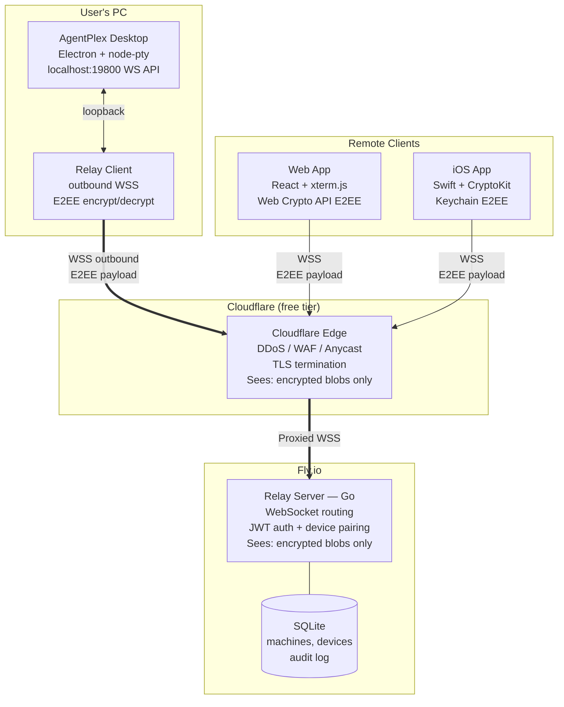
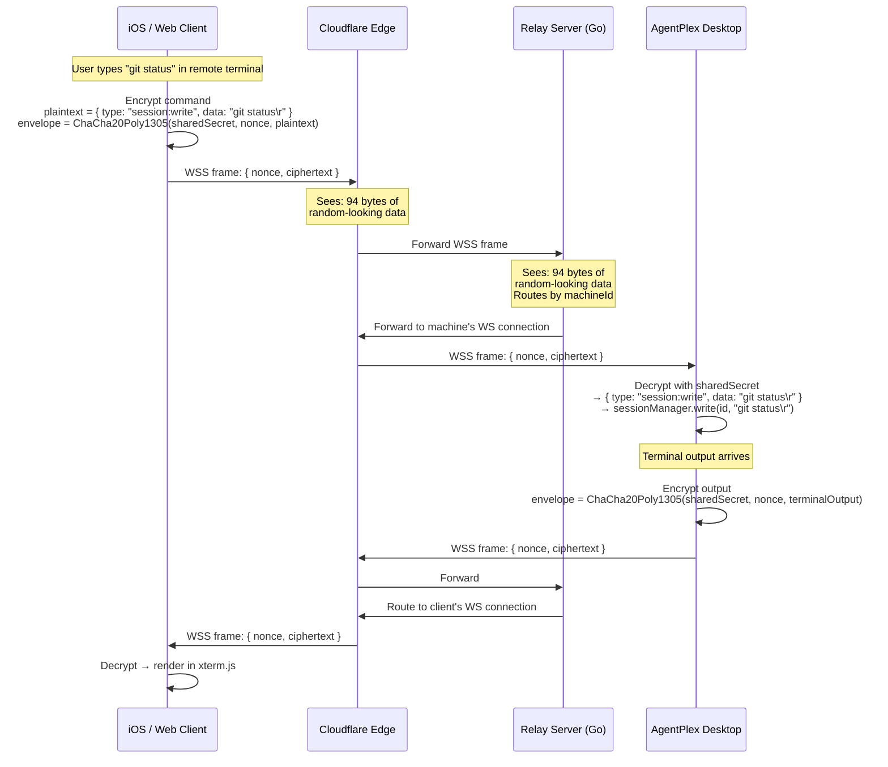
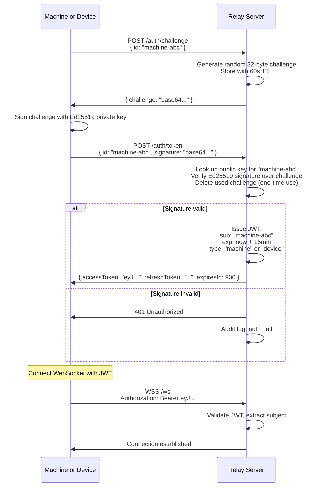
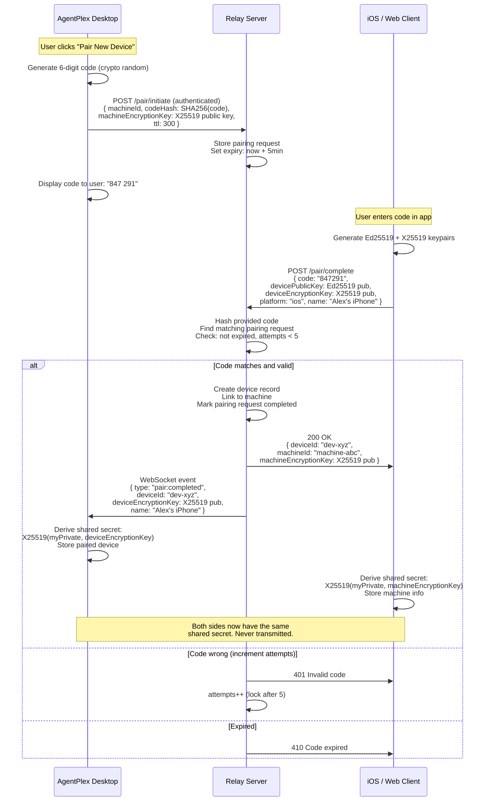
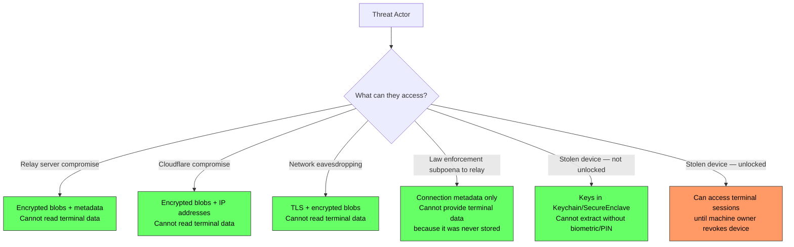

# AgentPlex Remote Relay — Architecture Document

> **Status**: Approved direction
> **Date**: 2026-04-12
> **Supersedes**: option-a-cloudflare-tunnel.md (rejected — no E2EE), option-b-cloud-relay-e2ee.md (draft)

## 1. Goal

Enable authenticated, end-to-end encrypted remote management of AgentPlex desktop sessions from a web browser or iOS app. The relay server is a blind pipe — it routes encrypted traffic between paired endpoints but can never read terminal data, commands, file contents, or any session payload.

## 2. Non-Goals

- The relay is NOT a terminal proxy — it does not interpret, buffer, or transform terminal data
- The relay does NOT manage sessions — it connects clients to the AgentPlex instance that does
- The relay does NOT store conversation data, terminal output, or any E2EE payload
- The relay does NOT replace the local WebSocket API server (`localhost:19800`) — it bridges remote clients to it

## 3. Architecture Overview



### Data Flow: A Remote Command



## 4. Component Breakdown

### 4.1 Relay Server (Go)

The relay is a standalone Go service deployed on Fly.io. It handles connection registration, device pairing, JWT authentication, and encrypted message routing.

#### Why Go

The relay holds thousands of persistent WebSocket connections and forwards real-time terminal data between them. This is a concurrent network service, not a web application.

| Requirement | Go Advantage |
|---|---|
| Thousands of persistent WebSocket connections | Goroutines: ~4KB per connection vs ~50-100KB in Node.js |
| Low-latency message forwarding | No GC pauses at scale; goroutine scheduler is designed for I/O multiplexing |
| Single-binary deployment | `go build` → 10MB binary, 15MB Docker image, no runtime deps |
| Dependency minimalism | 3 direct deps: WebSocket, JWT, SQLite. No `node_modules` |
| Production reliability | Battle-tested in infrastructure (Docker, Kubernetes, CockroachDB, Caddy — all Go) |
| Long-lived processes | Go's runtime is designed for servers that run for months without restart |

The "shared TypeScript types" argument does not apply: the relay forwards encrypted blobs it cannot read. The API surface between relay and clients is ~10 message types, defined once in a shared spec.

#### Directory Structure

```
relay/
├── cmd/
│   └── relay/
│       └── main.go              # Entry point, server startup
├── internal/
│   ├── auth/
│   │   ├── jwt.go               # JWT issuance and validation
│   │   └── challenge.go         # Ed25519 challenge-response auth
│   ├── pairing/
│   │   ├── code.go              # 6-digit pairing code generation
│   │   └── handler.go           # Pairing HTTP endpoints
│   ├── relay/
│   │   ├── hub.go               # Connection registry, message routing
│   │   ├── machine.go           # Machine WebSocket handler
│   │   └── client.go            # Client WebSocket handler
│   ├── store/
│   │   ├── store.go             # Database interface
│   │   └── sqlite.go            # SQLite implementation
│   └── audit/
│       └── logger.go            # Structured audit event logging
├── api/
│   └── messages.go              # Shared message type definitions
├── Dockerfile
├── fly.toml
├── go.mod
└── go.sum
```

#### Go Dependencies

```
nhooyr.io/websocket       # WebSocket (stdlib-friendly, context-aware)
github.com/golang-jwt/jwt/v5   # JWT creation and validation
modernc.org/sqlite        # Pure-Go SQLite (no CGo, no C compiler needed)
```

Three direct dependencies. Zero CGo. Builds cross-platform without toolchain fuss.

#### Core Hub Logic

```go
// internal/relay/hub.go

type Hub struct {
    mu       sync.RWMutex
    machines map[string]*MachineConn   // machineId → connection
    clients  map[string]*ClientConn    // deviceId → connection
    store    store.Store
    audit    *audit.Logger
}

// Route an encrypted envelope from client to machine (or vice versa)
func (h *Hub) RouteEnvelope(from string, env Envelope) {
    h.mu.RLock()
    defer h.mu.RUnlock()

    target := h.machines[env.To]   // or h.clients[env.To]
    if target == nil || target.ws == nil {
        return  // target offline — message dropped, client handles reconnect
    }

    // Forward the encrypted blob unchanged — relay cannot read it
    target.Send(env.Raw)
}
```

#### Database Schema

```sql
CREATE TABLE machines (
    machine_id    TEXT PRIMARY KEY,
    public_key    TEXT NOT NULL,          -- Ed25519 public key, base64
    display_name  TEXT,
    registered_at TEXT NOT NULL DEFAULT (datetime('now')),
    last_seen     TEXT
);

CREATE TABLE devices (
    device_id         TEXT PRIMARY KEY,
    public_key        TEXT NOT NULL,      -- Ed25519 public key, base64
    encryption_key    TEXT NOT NULL,      -- X25519 public key, base64 (for E2EE pairing)
    display_name      TEXT,
    platform          TEXT NOT NULL,      -- 'ios' | 'web' | 'android'
    paired_machine_id TEXT NOT NULL REFERENCES machines(machine_id),
    paired_at         TEXT NOT NULL DEFAULT (datetime('now')),
    last_seen         TEXT,
    revoked           INTEGER NOT NULL DEFAULT 0
);

CREATE TABLE pairing_requests (
    id          TEXT PRIMARY KEY,
    machine_id  TEXT NOT NULL REFERENCES machines(machine_id),
    code_hash   TEXT NOT NULL,           -- SHA-256 of the 6-digit code
    expires_at  TEXT NOT NULL,
    attempts    INTEGER NOT NULL DEFAULT 0,
    completed   INTEGER NOT NULL DEFAULT 0
);

CREATE TABLE audit_log (
    id         INTEGER PRIMARY KEY AUTOINCREMENT,
    timestamp  TEXT NOT NULL DEFAULT (datetime('now')),
    event      TEXT NOT NULL,            -- 'connect' | 'disconnect' | 'pair' | 'unpair' | 'auth_fail'
    machine_id TEXT,
    device_id  TEXT,
    client_ip  TEXT,
    metadata   TEXT                      -- JSON
);

CREATE INDEX idx_devices_machine ON devices(paired_machine_id) WHERE revoked = 0;
CREATE INDEX idx_audit_timestamp ON audit_log(timestamp);
CREATE INDEX idx_pairing_machine ON pairing_requests(machine_id) WHERE completed = 0;
```

### 4.2 Authentication

Auth is built directly into the relay. No external auth service — the pairing model is cryptographic, not identity-provider-based.

#### Key Types and Their Roles

```
Ed25519 keypair (signing)
├── Purpose: Prove identity ("I am this machine / device")
├── Used for: JWT auth — sign a challenge, relay verifies signature
├── Generated: Once per machine, once per device
└── Stored: OS keychain (desktop), Keychain/Secure Enclave (iOS), IndexedDB (web)

X25519 keypair (key agreement)
├── Purpose: Derive shared secret for E2EE
├── Used for: Encrypt/decrypt terminal data between machine ↔ device
├── Generated: Once per machine, once per device
├── Exchanged: During device pairing
└── Stored: Same locations as Ed25519 keys
```

Both key types use Curve25519. They can be derived from the same 32-byte seed, but for clarity and forward compatibility, we generate them independently.

#### Authentication Flow



#### JWT Structure

```json
{
  "sub": "machine-abc123",
  "type": "machine",
  "iat": 1744470000,
  "exp": 1744470900,
  "iss": "agentplex-relay"
}
```

- **Access token**: 15-minute TTL, used for WebSocket connections
- **Refresh token**: 30-day TTL, opaque token stored in relay DB, used to get new access tokens
- **Signing key**: Ed25519 keypair generated by the relay on first boot, stored in SQLite

#### JWT Library

`github.com/golang-jwt/jwt/v5` — the standard Go JWT library. Supports Ed25519 signing method natively.

### 4.3 Device Pairing



#### Pairing Security Properties

| Property | How |
|---|---|
| Code brute-force resistance | 6 digits = 1M possibilities, max 5 attempts, 5-minute window |
| Shared secret never transmitted | X25519 key agreement — only public keys cross the wire |
| Relay cannot derive shared secret | Relay sees both public keys but not the private keys |
| Pairing is device-specific | Each device gets its own keypair and shared secret |
| Revocation is instant | Machine removes device from paired list; relay marks as revoked |
| Re-pairing after revoke | Device must go through full pairing flow again with new code |

### 4.4 End-to-End Encryption

#### Cipher Suite

```
Key agreement:     X25519 (Curve25519 Diffie-Hellman)
Key derivation:    HKDF-SHA256
Symmetric cipher:  ChaCha20-Poly1305 (AEAD, 256-bit key, 96-bit nonce)
```

This is the same cipher suite used by WireGuard, TLS 1.3, and the Signal Protocol.

#### Key Derivation

```
sharedSecret = X25519(myPrivateKey, theirPublicKey)    // 32 bytes, same on both sides

sessionKey = HKDF-SHA256(
    ikm:  sharedSecret,
    salt: SHA256(machineId + ":" + deviceId),
    info: "agentplex-e2ee-v1",
    len:  32
)
```

#### Message Encryption

```
plaintext  = JSON.stringify({ type: "session:data", id: "session-1", data: "..." })
nonce      = random(12)                                // 96-bit, unique per message
aad        = machineId + ":" + deviceId                // additional authenticated data

ciphertext = ChaCha20Poly1305.Seal(sessionKey, nonce, plaintext, aad)

Wire envelope:
{
  "to": "machine-abc",                                 // routing hint for relay
  "nonce": "base64(nonce)",
  "ct": "base64(ciphertext + poly1305 tag)"
}
```

#### Implementation by Platform

| Platform | Crypto Library | Notes |
|---|---|---|
| AgentPlex Desktop (Node.js) | `crypto.createCipheriv('chacha20-poly1305')`, `crypto.diffieHellman` with X25519 | Built into Node.js, no external deps |
| Web Browser | Web Crypto API: `crypto.subtle.deriveKey()`, `crypto.subtle.encrypt()` | ChaCha20-Poly1305 not in Web Crypto — use `@noble/ciphers` (audited, zero-dep) |
| iOS App | CryptoKit: `Curve25519.KeyAgreement`, `ChaChaPoly` | First-party Apple framework, hardware-accelerated |
| Relay Server (Go) | `golang.org/x/crypto/chacha20poly1305`, `crypto/ecdh` | Standard library + x/crypto |

**Web Crypto limitation**: Web Crypto API supports AES-GCM but not ChaCha20-Poly1305 natively. Use `@noble/ciphers` by Paul Miller — audited, zero dependencies, constant-time implementation. This is the same author as `@noble/curves` (used by major crypto projects).

#### What E2EE Protects Against



### 4.5 CDN / DDoS Protection: Cloudflare (free tier)

Cloudflare sits in front of the Fly.io relay as a reverse proxy. Since all payload is E2EE, Cloudflare sees only encrypted blobs — the same threat model as any network hop.

#### What Cloudflare Provides

| Feature | Tier | Notes |
|---|---|---|
| DDoS mitigation (L3/L4 + L7) | Free | Automatic, no configuration |
| TLS termination + certificate management | Free | No Let's Encrypt cron jobs |
| Global anycast routing | Free | Client connects to nearest Cloudflare edge |
| WebSocket proxying | Free | 100-second idle timeout (sufficient for keepalive pings) |
| Rate limiting rules | Free (basic) | 1 rule on free, more on paid |
| Bot detection | Free (basic) | Challenge suspicious traffic |
| Analytics | Free | Connection counts, geographic distribution, error rates |

#### DNS Configuration

```
relay.agentplex.dev  CNAME  agentplex-relay.fly.dev  (Proxied — orange cloud)
```

That's it. Cloudflare handles TLS, caching headers are irrelevant (WebSocket traffic isn't cached), and DDoS protection is automatic.

#### Why This Is Safe

The relay's design principle is: **assume the relay is compromised**. E2EE ensures that even an adversary with full access to the relay (or Cloudflare, or both) can only see:

- That machine X and device Y are communicating
- How many bytes they exchange and when
- Their IP addresses

They cannot see what's being communicated. Adding Cloudflare in front doesn't weaken security — it's the same threat model as the relay itself. And it adds significant operational benefit (DDoS protection, TLS management, global routing) for $0.

### 4.6 Key Storage

#### AgentPlex Desktop (Electron)

Electron's `safeStorage` API encrypts data using the OS credential store:

| OS | Backend | Protection |
|---|---|---|
| Windows | DPAPI (Data Protection API) | Encrypted with user's login credentials |
| macOS | Keychain | Optionally hardware-backed on Apple Silicon |
| Linux | libsecret / kwallet | Desktop environment keyring |

```typescript
import { safeStorage } from 'electron';

// Store private key
const encrypted = safeStorage.encryptString(privateKeyBase64);
fs.writeFileSync('~/.agentplex/keys/machine.enc', encrypted);

// Load private key
const encrypted = fs.readFileSync('~/.agentplex/keys/machine.enc');
const privateKeyBase64 = safeStorage.decryptString(encrypted);
```

#### iOS App

```swift
import CryptoKit

// Generate X25519 keypair
let privateKey = Curve25519.KeyAgreement.PrivateKey()
let publicKey = privateKey.publicKey

// Store in Keychain (Secure Enclave on supported devices)
let query: [String: Any] = [
    kSecClass as String: kSecClassKey,
    kSecAttrApplicationTag as String: "dev.agentplex.machine-key",
    kSecAttrAccessible as String: kSecAttrAccessibleWhenUnlockedThisDeviceOnly,
    kSecValueData as String: privateKey.rawRepresentation
]
SecItemAdd(query as CFDictionary, nil)
```

#### Web Browser

```typescript
// Generate X25519 keypair (via @noble/curves)
import { x25519 } from '@noble/curves/ed25519';

const privateKey = x25519.utils.randomPrivateKey();
const publicKey = x25519.getPublicKey(privateKey);

// Store in IndexedDB (non-extractable via Web Crypto for signing keys)
const db = await openDB('agentplex-keys', 1);
await db.put('keys', { privateKey, publicKey }, 'machine');
```

Note: Web Crypto API's `extractable: false` flag applies to CryptoKey objects but X25519 isn't natively supported in Web Crypto. The `@noble/curves` library works with raw bytes stored in IndexedDB. The browser's same-origin policy and HTTPS requirement provide the isolation boundary.

## 5. Relay API Reference

### HTTP Endpoints

| Method | Path | Auth | Purpose |
|---|---|---|---|
| `GET` | `/health` | None | Health check |
| `POST` | `/auth/challenge` | None | Request auth challenge |
| `POST` | `/auth/token` | Signature | Exchange signed challenge for JWT |
| `POST` | `/auth/refresh` | Refresh token | Get new access token |
| `POST` | `/register/machine` | None (first time) | Register machine + public key |
| `POST` | `/pair/initiate` | JWT (machine) | Start pairing, submit code hash |
| `POST` | `/pair/complete` | None (code is auth) | Complete pairing with code + device public key |
| `DELETE` | `/devices/:deviceId` | JWT (machine) | Revoke a paired device |
| `GET` | `/devices` | JWT (machine) | List paired devices |
| `GET` | `/machines/:machineId/status` | JWT (device) | Check if machine is online |

### WebSocket Protocol

**Connection**: `wss://relay.agentplex.dev/ws` with `Authorization: Bearer <jwt>` header.

**Client → Relay:**

```jsonc
// Subscribe to a machine (devices only)
{ "type": "connect", "machineId": "machine-abc" }

// E2EE envelope (routed to target)
{ "type": "envelope", "to": "machine-abc", "nonce": "...", "ct": "..." }

// Keepalive (every 30s)
{ "type": "ping" }
```

**Relay → Client:**

```jsonc
// Connection established to machine
{ "type": "connected", "machineId": "machine-abc" }

// Machine went offline
{ "type": "machine:offline", "machineId": "machine-abc" }

// Machine came online
{ "type": "machine:online", "machineId": "machine-abc" }

// E2EE envelope from machine
{ "type": "envelope", "from": "machine-abc", "nonce": "...", "ct": "..." }

// Pairing completed (machine receives this)
{ "type": "pair:completed", "deviceId": "...", "deviceEncryptionKey": "...", "name": "..." }

// Pong
{ "type": "pong" }

// Error
{ "type": "error", "code": "...", "message": "..." }
```

## 6. Deployment

### Fly.io Configuration

```toml
# fly.toml
app = "agentplex-relay"
primary_region = "iad"

[build]
  dockerfile = "Dockerfile"

[env]
  LISTEN_ADDR = ":8080"
  DB_PATH = "/data/relay.db"

[http_service]
  internal_port = 8080
  force_https = true
  auto_stop_machines = false    # relay must stay running for persistent WS connections
  auto_start_machines = true
  min_machines_running = 1

[mounts]
  source = "relay_data"
  destination = "/data"
```

```dockerfile
# Dockerfile
FROM golang:1.23-alpine AS builder
WORKDIR /app
COPY go.mod go.sum ./
RUN go mod download
COPY . .
RUN CGO_ENABLED=0 go build -o /relay ./cmd/relay

FROM alpine:3.20
RUN apk add --no-cache ca-certificates
COPY --from=builder /relay /relay
EXPOSE 8080
CMD ["/relay"]
```

Image size: ~15MB. Startup time: <100ms.

### Multi-Region (future)

```bash
# Add regions for global coverage
fly regions add ams fra sin syd

# Fly.io automatically routes clients to the nearest region
# Internal mesh (.internal DNS) handles cross-region message routing
```

For cross-region routing: if a machine is connected to IAD and a client connects to AMS, the AMS relay instance forwards the envelope to IAD via Fly's internal WireGuard mesh. This adds ~50ms latency but no code changes — the Hub uses Fly's internal DNS to discover peers.

## 7. Security Summary

### Defense in Depth

```
┌──────────────────────────────────────────────────────────────────────┐
│ Layer 1: Network — Cloudflare DDoS + WAF                            │
│   Blocks volumetric attacks, bot traffic, IP reputation filtering    │
├──────────────────────────────────────────────────────────────────────┤
│ Layer 2: Transport — TLS 1.3 (Cloudflare → Relay → Client)         │
│   Encrypted in transit, certificate pinning optional on iOS          │
├──────────────────────────────────────────────────────────────────────┤
│ Layer 3: Identity — Ed25519 challenge-response + JWT                │
│   Cryptographic proof of identity, short-lived tokens, refresh flow  │
├──────────────────────────────────────────────────────────────────────┤
│ Layer 4: Authorization — Device pairing with code + key exchange    │
│   Only paired devices can communicate, machine controls revocation   │
├──────────────────────────────────────────────────────────────────────┤
│ Layer 5: Confidentiality — E2EE (X25519 + ChaCha20-Poly1305)       │
│   Relay and all intermediaries are cryptographically blind            │
│   Terminal data readable ONLY by the two paired endpoints            │
├──────────────────────────────────────────────────────────────────────┤
│ Layer 6: Integrity — Poly1305 MAC + AEAD additional authenticated   │
│   data (machineId:deviceId) prevents tampering and cross-pair replay │
├──────────────────────────────────────────────────────────────────────┤
│ Layer 7: Audit — All connection events logged in relay DB           │
│   connect, disconnect, pair, unpair, auth_fail with timestamps + IP  │
└──────────────────────────────────────────────────────────────────────┘
```

### Threat Model

| Threat | Impact | Mitigation |
|---|---|---|
| Relay server fully compromised | Metadata exposed (IPs, timestamps, connection patterns). No terminal data. | E2EE — attacker gets encrypted blobs only |
| Cloudflare fully compromised | Same as relay compromise — encrypted blobs + IPs | E2EE |
| Network eavesdropping (any hop) | Nothing useful — TLS + E2EE | Two independent encryption layers |
| Stolen device (locked) | No access — keys protected by biometric/PIN | OS keychain / Secure Enclave |
| Stolen device (unlocked) | Access until machine owner revokes | Revocation via AgentPlex desktop |
| Relay DDoS | Service disruption (no data loss) | Cloudflare DDoS protection |
| JWT theft | 15-minute window of unauthorized access | Short TTL, bound to machine/device ID |
| Pairing code brute-force | Blocked after 5 attempts, 5-minute window | Rate limiting + code expiry |
| Rogue relay operator | Cannot read traffic | E2EE — operator has no private keys |
| Supply chain (Go deps) | Low risk — 3 deps, all widely audited | Pin versions, verify checksums |

## 8. Bill of Materials

| Component | Technology | Cost/mo | Vendor Lock-in |
|---|---|---|---|
| Relay server | Go (single binary) | — | None |
| Relay hosting | Fly.io (1 shared-cpu VM + 1GB volume) | $5 | Low — standard Docker |
| CDN / DDoS | Cloudflare free tier (proxied DNS) | $0 | Low — just DNS |
| Auth | Custom Ed25519 + JWT (`golang-jwt`) | — | None |
| E2EE (desktop) | Node.js `crypto` (built-in) | — | None |
| E2EE (iOS) | Apple CryptoKit | — | None |
| E2EE (web) | `@noble/ciphers` + `@noble/curves` | — | None |
| Database | SQLite on Fly.io volume | $0 | None |
| Domain | `relay.agentplex.dev` | ~$1 | None |
| TLS certificates | Cloudflare (auto-managed) | $0 | None |
| **Total** | | **~$6/mo** | |

## 9. Implementation Roadmap

### Phase 1: Relay Server MVP

- Go project scaffolding, Fly.io deployment
- Machine registration and WebSocket connection
- JWT auth with Ed25519 challenge-response
- Device pairing flow (code generation, verification, key exchange)
- Envelope routing (forward encrypted blobs between paired machine ↔ device)
- SQLite storage for machines, devices, audit log
- Health endpoint, basic metrics

### Phase 2: AgentPlex Desktop Integration

- Relay client module in `src/main/remote/relay-client.ts`
- X25519 + ChaCha20-Poly1305 E2EE encrypt/decrypt
- Key generation and storage via `safeStorage`
- Device pairing UI in Settings (generate code, show paired devices, revoke)
- Automatic reconnect with exponential backoff
- Bridge: relay client ↔ local WS API server (`localhost:19800`)

### Phase 3: Web Client

- React app (separate repo or monorepo package)
- xterm.js terminal rendering
- Web Crypto API / `@noble/ciphers` E2EE
- Device registration and pairing flow
- Session list, terminal view, status indicators
- Deploy to Vercel / Cloudflare Pages (static site)

### Phase 4: iOS App

- Swift + SwiftUI
- CryptoKit for E2EE
- Keychain for key storage
- Terminal rendering (custom or WebView with xterm.js)
- Push notifications for session status changes (via relay)

### Phase 5: Production Hardening

- Multi-region Fly.io deployment
- Cross-region envelope routing via internal mesh
- Monitoring: Prometheus metrics, Grafana dashboard
- Alerting: relay uptime, connection counts, error rates
- Key rotation mechanism
- Rate limiting tuning based on real usage patterns
- Security audit of E2EE implementation
